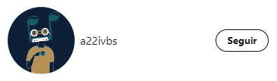
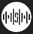

# Esquema de components

### Que tenim a la carpeta de components ?

*   Components
    
*   Icones
    

### Que components hi ha?

#### Menu:
Aquest és el menú de navegació de la nostra aplicació, l'utilitzem en gairebé totes les pàgines perquè l'usuari pugui moure's lliurement entre pàgina i pàgina.

#### Header:
Seccion on mostrem el Logo i el nom de Spottunes, una lupa per buscar usuaris i un botó per fer logout en cas que l'usuari estigui logejat. El fem servir a la pantalla d'Esdeveniments i Perfil.

#### Logout:
Aquí tenim la icona i les funcions per fer logout a l'aplicació. L'utilitzem al component Header.

#### CardUser:
Mostrem l'avatar i el nom d'un usuari i l'opció de poder seguir-lo. Aquest component el fem servir al cercador d'usuaris de Header.vue i a la pantalla de perfil.

#### CardEvent: 
Aquest component és cada carta d'un esdeveniment i el fem servir a la pantalla d'esdeveniments. 

#### UserCardEvent:
Mostra a la pantalla d'un esdeveniment individual, l'avatar, nom i opció de seguir al usuari. El fem servir al mostrar els usuaris que segueixen un esdeveniment.

#### PostsProfile:
Mostra el post creat pero un usuari a la pantalla de perfil. L'utilitzem per mostrar tots els posts que ha creat un usuari.

#### OpenImage:
Aquest és un component que utilitzem com a modal per poder ampliar i veure millor les imatges dels post. L'utilitzem a PostsProfile al fer clic a la imatge del post.

#### ReplyPost:
És un modal que utilitzem per deixar comentaris en un post de forma ràpida. L'utilitzem a PostsProfile.

#### PostDropDown:
Desplegable per manejar l'eliminació d'un post creat per l'usuari. L'utilitzem a PostsProfile.

#### EventosProfile:
Si l'usuari no segueix cap esdeveniment apareix una frase conforme aquest usuari no segueix esdeveniments, i si no mostra una petita preview de cada esdeveniment al que segueix. Això es mostra a la pantalla de perfil.

#### Logo:
Aquest és el svg del nostre logo. L'utilitzem a Header i Join.

#### Loader:
Aquest component és el del loader que hem utilitzat en tota l'aplicació. El fem servir a UserCardEvent, add-chat, xats, completar, edit-profile, login, register, google, spotify, events, perfil i post.

#### LoginMethods:
Aquí tenim els diferents mètodes per fer login a la nostra aplicació, com google, spotify o spottunes. Utilitzem el component a Login i Register.

#### Map:
Aquest component conté un mapa per poder filtrar els concerts per distància de la teva ubicació.

