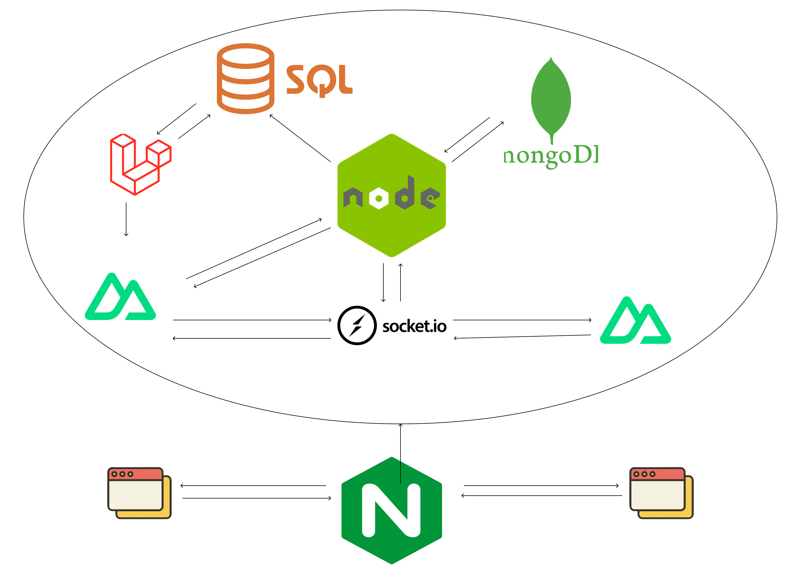

# Documentació tècnica

Aquest document té com a objectiu proporcionar una guia tècnica detallada sobre els diferents aspectes de Spottunes. És una referència dissenyada per ajudar els desenvolupadors a comprendre i gestionar eficientment el projecte.

# Índex

1. [Arquitectura de l'aplicació](#arquitectura-de-laplicació)
2. [Rutes de l'aplicació](#rutes-de-laplicació)
3. [Esquema d'esdeveniments (sockets)](#esquema-desdeveniments-sockets)
4. [Esquema de la base de dades](#esquema-de-la-base-de-dades)
5. [Esquema de components](#esquema-de-components)
6. [Documentació de frontend](#documentació-de-frontend)
7. [Documentació de backend](#documentació-de-backend)
8. [Proxy invers](#proxy-invers)
9. [Disseny](#disseny)
10. [Desplegament](#desplegament)

## Arquitectura de l'aplicació

L'arquitectura de l'aplicació està dissenyada per ser modular i escalable, distribuint les responsabilitats entre diversos components especialitzats. A continuació es presenta un esquema gràfic i una descripció de cada component, incloent les connexions i la informació que es transmet entre ells.



### Components de l'Arquitectura

1. **Node.js**:

   - **Funció**: Serveix com a servidor principal de l'aplicació, gestionant la lògica del backend, les connexions amb la base de dades i la comunicació en temps real i servint el frontend de la nostra aplicació web.
   - **Connexions**:
     - **SQL**: Per gestionar les dades relacionades i persistents. En aquest cas s'utilitza directament desde el Node per gestionar la introducció i el·liminació dels esdeveniments agafats de l'API de Ticketmaster.
     - **MongoDB**: Per gestionar les dades no relacionades. L'utilitzem per emmagatzemar els "m'agrada" a esdeveniments, als "posts" dels usuaris, els comentaris, etc... i tota la gestió dels xats entre usuaris.
     - **Socket.io**: Per a la comunicació en temps real entre el servidor i els clients per tal de tenir un sistema de xat en temps real.
     - **Laravel**: Comunicació amb l'API de Laravel.
     - **Nuxt.js (Client)**: Per servir la part del frontend desenvolupada amb Nuxt.js, gestionant la renderització del costat del servidor (SSR).

2. **Laravel**:

   - **Funció**: Serveix les rutes d'API que gestiona els esdeveniments i els usuaris.
   - **Connexions**:
     - **SQL**: Per gestionar la base de dades relacional.
     - **Nuxt.js (Client)**

3. **Nuxt.js (Client)**:

   - **Funció**: Framework per al desenvolupament del frontend, basat en Vue.js, amb suport per a renderització del costat del servidor (SSR).
   - **Connexions**:
     - **Node.js**: Per realitzar sol·licituds API i obtenir dades del servidor.
     - **Laravel**: Per obtenir dades o funcionalitats específiques de l'API Laravel.

4. **Socket.io**:
   - **Funció**: Creació i servei que gestiona els xats entre usuaris en temps real.
   - **Connexions**:
     - **Node.js**: Per gestionar les connexions WebSocket i proporcionar actualitzacions en temps real als clients.
     - **Nuxt.js (Client)**: Porta el front de la pàgina i actualitza la visualització dels missatges i els xats.

## Rutes de l'aplicació

## Esquema d'esdeveniments (sockets)

## Esquema de la base de dades

### SQL

### Mongo

## Esquema de components

### Que tenim a la carpeta de components ?

- Components
- Icones

### Que components hi ha?

#### Menu:

Aquest és el menú de navegació de la nostra aplicació, l'utilitzem en gairebé totes les pàgines perquè l'usuari pugui moure's lliurement entre pàgina i pàgina.


#### Header:

Seccion on mostrem el Logo i el nom de Spottunes, una lupa per buscar usuaris i un botó per fer logout en cas que l'usuari estigui logejat. El fem servir a la pantalla d'Esdeveniments i Perfil.


#### Logout:

Aquí tenim la icona i les funcions per fer logout a l'aplicació. L'utilitzem al component Header.


#### CardUser:

Mostrem l'avatar i el nom d'un usuari i l'opció de poder seguir-lo. Aquest component el fem servir al cercador d'usuaris de Header.vue i a la pantalla de perfil.


#### CardEvent:

Aquest component és cada carta d'un esdeveniment i el fem servir a la pantalla d'esdeveniments.


#### UserCardEvent:

Mostra a la pantalla d'un esdeveniment individual, l'avatar, nom i opció de seguir al usuari. El fem servir al mostrar els usuaris que segueixen un esdeveniment.


#### PostsProfile:

Mostra el post creat pero un usuari a la pantalla de perfil. L'utilitzem per mostrar tots els posts que ha creat un usuari.


#### OpenImage:

Aquest és un component que utilitzem com a modal per poder ampliar i veure millor les imatges dels post. L'utilitzem a PostsProfile al fer clic a la imatge del post.


#### ReplyPost:

És un modal que utilitzem per deixar comentaris en un post de forma ràpida. L'utilitzem a PostsProfile.


#### PostDropDown:

Desplegable per manejar l'eliminació d'un post creat per l'usuari. L'utilitzem a PostsProfile.


#### EventosProfile:

Si l'usuari no segueix cap esdeveniment apareix una frase conforme aquest usuari no segueix esdeveniments, i si no mostra una petita preview de cada esdeveniment al que segueix. Això es mostra a la pantalla de perfil.


#### Logo:

Aquest és el svg del nostre logo. L'utilitzem a Header i Join.


#### Loader:

Aquest component és el del loader que hem utilitzat en tota l'aplicació. El fem servir a UserCardEvent, add-chat, xats, completar, edit-profile, login, register, google, spotify, events, perfil i post.


#### LoginMethods:

Aquí tenim els diferents mètodes per fer login a la nostra aplicació, com google, spotify o spottunes. Utilitzem el component a Login i Register.


#### Map:

Aquest component conté un mapa per poder filtrar els concerts per distància de la teva ubicació.


## Documentació de frontend

## Documentació de backend

## Proxy invers

La nostra aplicació web s'ha desplegat amb Docker, per tant, per facilitar la comunicació entre els diferents dockers i poder aplicar un certificat SSL a tots els mòduls que conté aquesta pàgina hem decidit implementar un proxy invers amb Nginx.

### Justificació de l'ús del proxy invers

- **Seguretat**: Afegint una capa addicional de seguretat amb SSL.
- **Abstracció**: Oculta la infraestructura backend.

### Arxiu de configuració

```
server {
	server_name spottunes.daw.inspedralbes.cat;

	location /{
		proxy_pass http://localhost:3000;
		proxy_set_header Host $host;
		proxy_set_header X-Real-IP $remote_addr;
		proxy_set_header X-Forwarded-For $proxy_add_x_forwarded_for;
		proxy_set_header X-Forwarded-Proto $scheme;
	}

	location /pma{
		rewrite ^/pma(/.*)$ $1 break;
		proxy_pass http://localhost:9091/;
		proxy_set_header Host $host;
                proxy_set_header X-Real-IP $remote_addr;
                proxy_set_header X-Forwarded-For $proxy_add_x_forwarded_for;
                proxy_set_header X-Forwarded-Proto $scheme;
	}

	location /portainer/ {
		proxy_pass https://localhost:9443/;
                proxy_set_header Host $host;
                proxy_set_header X-Real-IP $remote_addr;
                proxy_set_header X-Forwarded-For $proxy_add_x_forwarded_for;
                proxy_set_header X-Forwarded-Proto $scheme;
	}

#	location /mongoexpress {
#		rewrite ^/mongoexpress(/.*)$ $1 break;
#		proxy_pass http://locahost:8081/;
#               proxy_set_header Host $host;
#               proxy_set_header X-Real-IP $remote_addr;
#               proxy_set_header X-Forwarded-For $proxy_add_x_forwarded_for;
#               proxy_set_header X-Forwarded-Proto $scheme;
#	}

	location /laravel{
		proxy_pass http://localhost:8000/public;
		proxy_set_header Host $host;
                proxy_set_header X-Real-IP $remote_addr;
                proxy_set_header X-Forwarded-For $proxy_add_x_forwarded_for;
                proxy_set_header X-Forwarded-Proto $scheme;
	}

	location /node/ {
		proxy_pass http://localhost:8086/;
                proxy_http_version 1.1;
	        proxy_set_header Host $host;
	        proxy_set_header Upgrade $http_upgrade;
	        proxy_set_header Connection "upgrade";
	        proxy_cache_bypass $http_upgrade;
	}

	location /socket/{
		proxy_set_header X-Forwarded-For $proxy_add_x_forwarded_for;
		proxy_set_header Host $host;

		proxy_pass http://localhost:8085;

		proxy_http_version 1.1;
		proxy_set_header Upgrade $http_upgrade;
		proxy_set_header Connection "upgrade";
	}


    listen 443 ssl; # managed by Certbot
    ssl_certificate /etc/letsencrypt/live/spottunes.daw.inspedralbes.cat/fullchain.pem; # managed by Certbot
    ssl_certificate_key /etc/letsencrypt/live/spottunes.daw.inspedralbes.cat/privkey.pem; # managed by Certbot
    include /etc/letsencrypt/options-ssl-nginx.conf; # managed by Certbot
    ssl_dhparam /etc/letsencrypt/ssl-dhparams.pem; # managed by Certbot

}

server {
    if ($host = spottunes.daw.inspedralbes.cat) {
        return 301 https://$host$request_uri;
    } # managed by Certbot


	server_name spottunes.daw.inspedralbes.cat;
    return 404; # managed by Certbot


}
```

### Rutes del proxy invers

- `/`: Redirigeix al port 3000. Es tracta del frontend de Nuxt montat sobre un servidor de node.
- `/pma`: Redirigeix al port 9091 al phpmyadmin.
- `/portainer/`: Redirigeix al port 9443 al portainer.
- `/laravel`: Redirigeix al port 8000, específicament a `/public`. S'encarrega de servir i dirigir les peticions d'API de Laravel i les rutes de les imatges.
- `/node/` i `/socket/`: Redirigeixen respectivament als ports 8086 i 8085, utilitzant WebSocket (al port 8086) per a la comunicació en temps real.

## Disseny

## Desplegament

### Workflow de treball

El desplegament de l'aplicació Spottunes s'ha realitzat utilitzant Oracle Cloud Infrastructure (OCI) i Docker. A continuació les raons per triar OCI:

#### Justificació de l'ús d'OCI

- **Escalabilitat**: OCI proporciona una infraestructura escalable que permet ajustar els recursos en funció de la demanda de l'aplicació.
- **Rendiment**: OCI ofereix màquines virtuals d'alt rendiment que asseguren una execució fluida i ràpida de l'aplicació.
- **Seguretat**: Les eines i serveis de seguretat d'OCI asseguren la protecció de les dades i la infraestructura.
- **Cost-eficiència**: OCI proporciona opcions de preus competitius que s'ajusten al pressupost del projecte.
- **Integració**: OCI permet la integració amb altres serveis i eines que faciliten el desplegament i la gestió de l'aplicació.

#### Configuració del Docker compose

Aquí tens un exemple de com podria ser el fitxer `docker-compose.yml`. Els espais en blanc s'omplen mitjançant `github actions`.

```
services:
  node:
    container_name: node
    image: arm64v8/node
    volumes:
      - ./node:/usr/src/app
    working_dir: /usr/src/app
    ports:
      - 8080:8080
    command: sh -c "npm install && npm run start"
    restart: always
    depends_on:
      - db

  nodeChat:
    container_name: nodeChat
    image: arm64v8/node
    volumes:
      - ./nodeChat:/usr/src/app
    working_dir: /usr/src/app
    ports:
      - 8085:8080
    command: sh -c "npm install && node index.js"
    restart: always
    depends_on:
      - laravel

  nodeMongo:
    container_name: nodeMongo
    image: arm64v8/node
    volumes:
      - ./node:/usr/src/app
    working_dir: /usr/src/app
    ports:
      - 8086:8080
    command: sh -c "npm install && npm run mongo"
    restart: always
    depends_on:
      - mongodb

  phpmyadmin:
    container_name: phpmyadmin
    image: arm64v8/phpmyadmin
    restart: always
    ports:
      - 9091:80
    depends_on:
      - db

  laravel:
    container_name: laravel
    build: ./laravel
    volumes:
      - ./laravel:/var/www/html
    ports:
      - 8000:80
    environment:
      - APACHE_DOCUMENT_ROOT=/var/www/html/public
    command: /bin/sh -c "composer install --no-interaction && chown -R www-data:www-data *&& chown -R www-data:www-data /var/www/html/public/images && php artisan migrate --force && apache2-foreground "
    restart: always
    depends_on:
      - db

  nuxt:
    container_name: nuxt
    image: arm64v8/node
    working_dir: /usr/src/app
    volumes:
      - ./nuxt:/usr/src/app
    ports:
      - 3000:3000
    environment:
      - WATCHPACK_POLLING=true
      - CHOKIDAR_USEPOLLING=true
    tmpfs:
      - /tmp
    command: sh -c "node ./server/index.mjs -- --host=http://spottunes.daw.inspedralbes.cat:8081"
    depends_on:
      - node

  db:
    container_name: db
    image: mysql:8.2.0
    restart: always
    environment:
      MYSQL_ROOT_PASSWORD:
      MYSQL_DATABASE: spottunes
    ports:
      - 3306:3306
    volumes:
      - ./mysql_data:/var/lib/mysql
      - ./mysql/dades.sql:/docker-entrypoint-initdb.d/dades.sql

  mongodb:
    container_name: mongodb
    image: mongo:latest
    restart: always
    ports:
      - 27017:27017
    environment:
      MONGO_INITDB_ROOT_USERNAME: root
      MONGO_INITDB_ROOT_PASSWORD:
    volumes:
      - ./mongodb_data:/data/db

  mongo-express:
    container_name: mongo-express
    image: arm64v8/mongo-express
    restart: always
    ports:
      - 8081:8081
    environment:
      ME_CONFIG_MONGODB_ADMINUSERNAME: root
      ME_CONFIG_MONGODB_ADMINPASSWORD:
      ME_CONFIG_BASICAUTH_USERNAME: root
      ME_CONFIG_BASICAUTH_PASSWORD:
      ME_CONFIG_MONGODB_SERVER: mongodb
    depends_on:
      - mongodb

```

#### Desplegament amb `Github Actions`

Aquí s'adjunta la `Github Action` que s'està utilitzant actualment per desplegar la pàgina web a servidor.

```
name: Spottunes Deploy Actions
run-name: ${{ github.actor }} is deploying Spottunes 🚀 
on:
  push:
    branches:
      - main

jobs:
  stop-docker:
    runs-on: ubuntu-latest
    steps:
      - name: Checkout del código
        uses: actions/checkout@v4

      - name: Conexión al servidor y stop de docker-compose
        run: |
          echo "${{ secrets.SECRET_KEY }}" > ~/prod_key.pem
          chmod 600 ~/prod_key.pem
          ssh -o StrictHostKeyChecking=no -o UserKnownHostsFile=/dev/null -i ~/prod_key.pem ${{ secrets.PROD_USER }}@${{ secrets.PROD_HOST }} "docker compose down"
      - run: echo "🍏 This job's status is ${{ job.status }}."

  fill-docker-compose:
    runs-on: ubuntu-latest
    needs: [stop-docker]
    steps:
      - name: Checkout del código
        uses: actions/checkout@v4

      - name: Conexión al servidor y modificar docker-compose
        run: |
          echo "Connecting to the server and running docker-compose commands"
          echo "${{ secrets.SECRET_KEY }}" > ~/prod_key.pem
          chmod 600 ~/prod_key.pem
          sed -i 's#MYSQL_ROOT_PASSWORD:#MYSQL_ROOT_PASSWORD: ${{ secrets.DB_PASSWORD }}#g' docker-compose.yml
          sed -i 's#MONGO_INITDB_ROOT_USERNAME:#MONGO_INITDB_ROOT_USERNAME: ${{ secrets.MONGO_INITDB_ROOT_USERNAME }}#g' docker-compose.yml
          sed -i 's#MONGO_INITDB_ROOT_PASSWORD:#MONGO_INITDB_ROOT_PASSWORD: ${{ secrets.MONGO_INITDB_ROOT_PASSWORD }}#g' docker-compose.yml
          sed -i 's#ME_CONFIG_MONGODB_ADMINUSERNAME:#ME_CONFIG_MONGODB_ADMINUSERNAME: ${{ secrets.MONGO_INITDB_ROOT_USERNAME }}#g' docker-compose.yml
          sed -i 's#ME_CONFIG_MONGODB_ADMINPASSWORD:#ME_CONFIG_MONGODB_ADMINPASSWORD: ${{ secrets.MONGO_INITDB_ROOT_PASSWORD }}#g' docker-compose.yml
          sed -i 's#ME_CONFIG_BASICAUTH_USERNAME:#ME_CONFIG_BASICAUTH_USERNAME: ${{ secrets.MONGO_USER }}#g' docker-compose.yml
          sed -i 's#ME_CONFIG_BASICAUTH_PASSWORD:#ME_CONFIG_BASICAUTH_PASSWORD: ${{ secrets.MONGO_PASSWORD }}#g' docker-compose.yml
          scp -o StrictHostKeyChecking=no -o UserKnownHostsFile=/dev/null -i "~/prod_key.pem" -r ./docker-compose.yml ${{ secrets.PROD_USER }}@${{ secrets.PROD_HOST }}:docker-compose.yml
      - run: echo "🍏 This job's status is ${{ job.status }}."

  deployment-laravel:
    needs: [fill-docker-compose]
    runs-on: ubuntu-latest
    steps:
      - name: Checkout del código
        uses: actions/checkout@v4

      - name: Conexión al servidor y deploy de laravel
        run: |
          echo "${{ secrets.SECRET_KEY }}" > ~/prod_key.pem
          chmod 600 ~/prod_key.pem
          cd laravel
          cp .env.example .env
          sed -i 's/DB_HOST=/DB_HOST=db/g' .env
          sed -i 's/DB_DATABASE=/DB_DATABASE=spottunes/g' .env
          sed -i 's/DB_USERNAME=/DB_USERNAME=${{ secrets.DB_USERNAME }}/g' .env
          sed -i 's#DB_PASSWORD=#DB_PASSWORD=${{ secrets.DB_PASSWORD }}#g' .env
          cd ${{ github.workspace }}
          ssh -o StrictHostKeyChecking=no -o UserKnownHostsFile=/dev/null -i ~/prod_key.pem ${{ secrets.PROD_USER }}@${{ secrets.PROD_HOST }} "[ -d laravel ] && sudo rm -r laravel"
          ssh -o StrictHostKeyChecking=no -o UserKnownHostsFile=/dev/null -i ~/prod_key.pem ${{ secrets.PROD_USER }}@${{ secrets.PROD_HOST }} "mkdir laravel"
          scp -o StrictHostKeyChecking=no -o UserKnownHostsFile=/dev/null -i "~/prod_key.pem" -r ./laravel/* ${{ secrets.PROD_USER }}@${{ secrets.PROD_HOST }}:laravel
          scp -o StrictHostKeyChecking=no -o UserKnownHostsFile=/dev/null -i "~/prod_key.pem" -r ./laravel/.env ${{ secrets.PROD_USER }}@${{ secrets.PROD_HOST }}:laravel
          ssh -o StrictHostKeyChecking=no -o UserKnownHostsFile=/dev/null -i ~/prod_key.pem ${{ secrets.PROD_USER }}@${{ secrets.PROD_HOST }} "chmod -R 775 laravel/"
      - run: echo "🍏 This job's status is ${{ job.status }}."

  deployment-node:
    needs: [fill-docker-compose]
    runs-on: ubuntu-latest
    steps:
      - name: Checkout del código
        uses: actions/checkout@v4

      - name: Conexión al servidor y deploy de node
        run: |
          echo "${{ secrets.SECRET_KEY }}" > ~/prod_key.pem
          chmod 600 ~/prod_key.pem
          cd node
          cp .env.example .env
          sed -i 's/DB_HOST=/DB_HOST=db/g' .env
          sed -i 's/DB_DATABASE=/DB_DATABASE=spottunes/g' .env
          sed -i 's/DB_USERNAME=/DB_USERNAME=${{ secrets.DB_USERNAME }}/g' .env
          sed -i 's#DB_PASSWORD=#DB_PASSWORD=${{ secrets.DB_PASSWORD }}#g' .env
          sed -i 's#TICKETMASTER_API_KEY=#TICKETMASTER_API_KEY=${{ secrets.TICKETMASTER_API_KEY }}#g' .env
          cd ${{ github.workspace }}
          ssh -o StrictHostKeyChecking=no -o UserKnownHostsFile=/dev/null -i ~/prod_key.pem ${{ secrets.PROD_USER }}@${{ secrets.PROD_HOST }} "[ -d node ] && sudo rm -r node"
          ssh -o StrictHostKeyChecking=no -o UserKnownHostsFile=/dev/null -i ~/prod_key.pem ${{ secrets.PROD_USER }}@${{ secrets.PROD_HOST }} "mkdir node"
          scp -o StrictHostKeyChecking=no -o UserKnownHostsFile=/dev/null -i "~/prod_key.pem" -r ./node/* ${{ secrets.PROD_USER }}@${{ secrets.PROD_HOST }}:node
          scp -o StrictHostKeyChecking=no -o UserKnownHostsFile=/dev/null -i "~/prod_key.pem" -r ./node/.env ${{ secrets.PROD_USER }}@${{ secrets.PROD_HOST }}:node
          ssh -o StrictHostKeyChecking=no -o UserKnownHostsFile=/dev/null -i ~/prod_key.pem ${{ secrets.PROD_USER }}@${{ secrets.PROD_HOST }} "chmod -R 775 node/"
      - run: echo "🍏 This job's status is ${{ job.status }}."

  deployement-next:
    needs: [fill-docker-compose]
    runs-on: ubuntu-latest
    steps:
      - name: Checkout del código
        uses: actions/checkout@v4

      - name: Conexión al servidor y deploy de next
        run: |
          echo "${{ secrets.SECRET_KEY }}" > ~/prod_key.pem
          chmod 600 ~/prod_key.pem
          cd next
          cp .env.example .env
          sed -i 's#NEXT_PUBLIC_SPOTIFY_CLIENT_ID=#NEXT_PUBLIC_SPOTIFY_CLIENT_ID=${{ secrets.SPOTIFY_CLIENT_ID }}#g' .env
          sed -i 's#NEXT_PUBLIC_SPOTIFY_CLIENT_SECRET=#NEXT_PUBLIC_SPOTIFY_CLIENT_SECRET=${{ secrets.SPOTIFY_CLIENT_SECRET }}#g' .env
          sed -i 's#NEXT_PUBLIC_SPOTIFY_REDIRECT_URI=#NEXT_PUBLIC_SPOTIFY_REDIRECT_URI=${{ secrets.SPOTIFY_REDIRECT_URI }}#g' .env
          sed -i 's#NEXT_PUBLIC_GOOGLE_CLIENT_ID=#NEXT_PUBLIC_GOOGLE_CLIENT_ID=${{ secrets.GOOGLE_CLIENT_ID }}#g' .env
          sed -i 's#NEXT_PUBLIC_GOOGLE_CLIENT_SECRET=#NEXT_PUBLIC_GOOGLE_CLIENT_SECRET=${{ secrets.GOOGLE_CLIENT_SECRET }}#g' .env
          sed -i 's#NEXT_PUBLIC_GOOGLE_REDIRECT_URI=#NEXT_PUBLIC_GOOGLE_REDIRECT_URI=${{ secrets.GOOGLE_REDIRECT_URI }}#g' .env
          cd ${{ github.workspace }}
          ssh -o StrictHostKeyChecking=no -o UserKnownHostsFile=/dev/null -i ~/prod_key.pem ${{ secrets.PROD_USER }}@${{ secrets.PROD_HOST }} "[ -d next ] && sudo rm -r next"
          ssh -o StrictHostKeyChecking=no -o UserKnownHostsFile=/dev/null -i ~/prod_key.pem ${{ secrets.PROD_USER }}@${{ secrets.PROD_HOST }} "mkdir next"
          scp -o StrictHostKeyChecking=no -o UserKnownHostsFile=/dev/null -i "~/prod_key.pem" -r ./next/* ${{ secrets.PROD_USER }}@${{ secrets.PROD_HOST }}:next
          scp -o StrictHostKeyChecking=no -o UserKnownHostsFile=/dev/null -i "~/prod_key.pem" -r ./next/.env ${{ secrets.PROD_USER }}@${{ secrets.PROD_HOST }}:next
          ssh -o StrictHostKeyChecking=no -o UserKnownHostsFile=/dev/null -i ~/prod_key.pem ${{ secrets.PROD_USER }}@${{ secrets.PROD_HOST }} "chmod -R 775 next/"
      - run: echo "🍏 This job's status is ${{ job.status }}."

  start-docker:
    needs: [deployment-laravel, deployment-node, deployement-next]
    runs-on: ubuntu-latest
    steps:
      - name: Conexión al servidor y start de docker-compose
        run: |
          echo "${{ secrets.SECRET_KEY }}" > ~/prod_key.pem
          chmod 600 ~/prod_key.pem
          ssh -o StrictHostKeyChecking=no -o UserKnownHostsFile=/dev/null -i ~/prod_key.pem ${{ secrets.PROD_USER }}@${{ secrets.PROD_HOST }} "docker compose up -d"
      - run: echo "🍏 This job's status is ${{ job.status }}."

```
