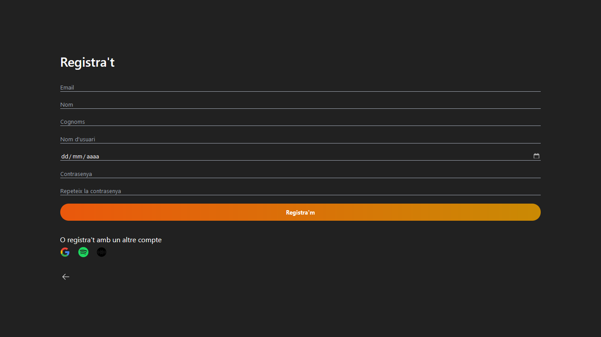

# Documentació tècnica

Aquest document té com a objectiu proporcionar una guia tècnica detallada sobre els diferents aspectes de Spottunes. És una referència dissenyada per ajudar els desenvolupadors a comprendre i gestionar eficientment el projecte.

# Índex

1. [Arquitectura de l'aplicació](#arquitectura-de-laplicació)
2. [Rutes de l'aplicació](#rutes-de-laplicació)
3. [Esquema d'esdeveniments (sockets)](#esquema-desdeveniments-sockets)
4. [Esquema de la base de dades](#esquema-de-la-base-de-dades)
5. [Esquema de components](#esquema-de-components)
6. [Documentació de frontend](#documentació-de-frontend)
7. [Documentació de backend](#documentació-de-backend)
8. [Proxy invers](#proxy-invers)
9. [Disseny](#disseny)
10. [Desplegament](#desplegament)

## Arquitectura de l'aplicació

L'arquitectura de l'aplicació està dissenyada per ser modular i escalable, distribuint les responsabilitats entre diversos components especialitzats. A continuació es presenta un esquema gràfic i una descripció de cada component, incloent les connexions i la informació que es transmet entre ells.


### Components de l'Arquitectura

1. **Node.js**:

   - **Funció**: Serveix com a servidor principal de l'aplicació, gestionant la lògica del backend, les connexions amb la base de dades i la comunicació en temps real i servint el frontend de la nostra aplicació web.
   - **Connexions**:
     - **SQL**: Per gestionar les dades relacionades i persistents. En aquest cas s'utilitza directament desde el Node per gestionar la introducció i el·liminació dels esdeveniments agafats de l'API de Ticketmaster.
     - **MongoDB**: Per gestionar les dades no relacionades. L'utilitzem per emmagatzemar els "m'agrada" a esdeveniments, als "posts" dels usuaris, els comentaris, etc... i tota la gestió dels xats entre usuaris.
     - **Socket.io**: Per a la comunicació en temps real entre el servidor i els clients per tal de tenir un sistema de xat en temps real.
     - **Laravel**: Comunicació amb l'API de Laravel.
     - **Nuxt.js (Client)**: Per servir la part del frontend desenvolupada amb Nuxt.js, gestionant la renderització del costat del servidor (SSR).

2. **Laravel**:

   - **Funció**: Serveix les rutes d'API que gestiona els esdeveniments i els usuaris.
   - **Connexions**:
     - **SQL**: Per gestionar la base de dades relacional.
     - **Nuxt.js (Client)**

3. **Nuxt.js (Client)**:

   - **Funció**: Framework per al desenvolupament del frontend, basat en Vue.js, amb suport per a renderització del costat del servidor (SSR).
   - **Connexions**:
     - **Node.js**: Per realitzar sol·licituds API i obtenir dades del servidor.
     - **Laravel**: Per obtenir dades o funcionalitats específiques de l'API Laravel.

4. **Socket.io**:
   - **Funció**: Creació i servei que gestiona els xats entre usuaris en temps real.
   - **Connexions**:
     - **Node.js**: Per gestionar les connexions WebSocket i proporcionar actualitzacions en temps real als clients.
     - **Nuxt.js (Client)**: Porta el front de la pàgina i actualitza la visualització dels missatges i els xats.

## Rutes de l'aplicació

### [/](https://spottunes.daw.inspedralbes.cat/)

Es la landing-page que et permet anar directament a la pantalla d'esdeveniments o a iniciar sessió.


### [/events](https://spottunes.daw.inspedralbes.cat/events)

La pàgina d'esdeveniments es on es llisten els esdeveniments proveïts per Ticketmaster. Fent click a un esdeveniment entrem a la seva pantalla individual.


### [/events/[id]](https://spottunes.daw.inspedralbes.cat/events/9)

La pàgina d'un esdeveniment mostra informació més detallada de l'esdeveniment que no es troba a la pantalla inicial. També trobem a la gent que segueix al esdeveniment.

S'ha d'haver iniciat sessió per accedir a aquesta pantalla.


### [/join](https://spottunes.daw.inspedralbes.cat/join)

La pàgina a la ruta `/join` es la pantalla on trobem les opcions per registrar-se o iniciar sessió.


### [/auth/callback/google](https://spottunes.daw.inspedralbes.cat/auth/callback/google) i [/auth/callback/spotify](https://spottunes.daw.inspedralbes.cat/auth/callback/spotify)

Les dues pantalles de callback son, visualment, només un loader per s'encarreguen de prendre les dades del login de Spotify i Google i redirigir a `/completar` per tal de completar les dades que faltin i guardar l'usuari en base de dades.

### [/completar](https://spottunes.daw.inspedralbes.cat/completar)

A aquesta pantalla podrem escollir la nostra contrasenya, l'usuari que tindrem (@) i la data de naixement després del login de Spotify i el de Google.


### [/login](https://spottunes.daw.inspedralbes.cat/login) i [/register](https://spottunes.daw.inspedralbes.cat/register)

El login i el registre s'utitlizen per accedir al teu usuari de la pàgina.




### [/chats](https://spottunes.daw.inspedralbes.cat/chats)

Aquesta es la pantalla on es trobaran els xats existents i el filtre per crear un xat nou amb un usuari registrar. S'ha d'haver iniciat sessió per accedir a aquesta pantalla.


### [/chat](https://spottunes.daw.inspedralbes.cat/chat)

Es la pantalla on es veurà el xat amb un usuari. S'ha d'haver iniciat sessió per accedir a aquesta pantalla.


### [/perfil](https://spottunes.daw.inspedralbes.cat/perfil)

Es la pantalla del teu perfil on pots trobar els teus posts, els esdeveniments que segueixes i els teus seguidors/seguits. S'ha d'haver iniciat sessió per accedir a aquesta pantalla.


### [/perfil/[username]](https://spottunes.daw.inspedralbes.cat/perfil/APorLa15)

Es la pantalla del perfil d'un altre usuari on pots veure els seus posts, els seus esdeveniments i els seus seguidors/seguits. S'ha d'haver iniciat sessió per accedir a aquesta pantalla.


### [/perfil/[username]/[type]](https://spottunes.daw.inspedralbes.cat/perfil/APorLa15/followers)

A aquesta pantalla es podran veure els seguidors/seguits de l'usuari indicat. S'ha d'haver iniciat sessió per accedir a aquesta pantalla.


### [/post](https://spottunes.daw.inspedralbes.cat/post)

Pantalla per escriure un post i pujar-lo. S'ha d'haver iniciat sessió per accedir a aquesta pantalla.


### [/post/[id]](https://spottunes.daw.inspedralbes.cat/post/1)

Aquí es pot visualitzar un post i els seus comentaris. També pots comentar aquest post. S'ha d'haver iniciat sessió per accedir a aquesta pantalla.


## Esquema d'esdeveniments (sockets)

Els sockets de la aplicació només els utilitzem per el xat, l'esquema es el següent:


## `socket.emit("logged")`

### Client

Quant inicia sessió o es registra fa aquest emit per vincular l'id d'usuari amb el del socket y ho guardem a un array per que quedi vinculat

## `socket.emit("joinChat")`

## `socket.emit("message")`

Rep el chatId i l'uneix a una room que el nom es aquest chatId per enviar missatges a l'altre persona

## `socket.emit("message")`

### Servidor

Rep el missatge i l'id del contacte. El primer que fa segons com estigui la room o l'usuari connecta a l'aplicació li posa un estat o un altre al missatge que hem rebut. Després inserta el missatge a la base de dades, una vegada insertat si es el primer missatge del chat l'uneix a la room del chat.

### Client

## `socket.emit("notification")`

Envia el missatge per poder mostrarlo per pantalla en el chat. En cas de no ser 2 persones a la room envia el següent

### Servidor

Indica al front que com ho són 2 usuaris a la room pero que si esta connectat li salti una notificació indicant-li que ha rebut un nou missatge

## `socket.emit("leaveChat")`

### Client

Envia el chatId

### Servidor

Rep el chatId i el desconecta de la room amb aquell chatId

## Esquema de la base de dades

### SQL


### Mongo

## Esquema de components

### Que tenim a la carpeta de components ?

- Components
- Icones

### Que components hi ha?

#### Menu:

Aquest és el menú de navegació de la nostra aplicació, l'utilitzem en gairebé totes les pàgines perquè l'usuari pugui moure's lliurement entre pàgina i pàgina.


#### Header:

Seccion on mostrem el Logo i el nom de Spottunes, una lupa per buscar usuaris i un botó per fer logout en cas que l'usuari estigui logejat. El fem servir a la pantalla d'Esdeveniments i Perfil.


#### Logout:

Aquí tenim la icona i les funcions per fer logout a l'aplicació. L'utilitzem al component Header.


#### CardUser:

Mostrem l'avatar i el nom d'un usuari i l'opció de poder seguir-lo. Aquest component el fem servir al cercador d'usuaris de Header.vue i a la pantalla de perfil.


#### CardEvent:

Aquest component és cada carta d'un esdeveniment i el fem servir a la pantalla d'esdeveniments.


#### UserCardEvent:

Mostra a la pantalla d'un esdeveniment individual, l'avatar, nom i opció de seguir al usuari. El fem servir al mostrar els usuaris que segueixen un esdeveniment.


#### PostsProfile:

Mostra el post creat pero un usuari a la pantalla de perfil. L'utilitzem per mostrar tots els posts que ha creat un usuari.


#### OpenImage:

Aquest és un component que utilitzem com a modal per poder ampliar i veure millor les imatges dels post. L'utilitzem a PostsProfile al fer clic a la imatge del post.


#### ReplyPost:

És un modal que utilitzem per deixar comentaris en un post de forma ràpida. L'utilitzem a PostsProfile.


#### PostDropDown:

Desplegable per manejar l'eliminació d'un post creat per l'usuari. L'utilitzem a PostsProfile.


#### EventosProfile:

Si l'usuari no segueix cap esdeveniment apareix una frase conforme aquest usuari no segueix esdeveniments, i si no mostra una petita preview de cada esdeveniment al que segueix. Això es mostra a la pantalla de perfil.


#### Logo:

Aquest és el svg del nostre logo. L'utilitzem a Header i Join.


#### Loader:

Aquest component és el del loader que hem utilitzat en tota l'aplicació. El fem servir a UserCardEvent, add-chat, xats, completar, edit-profile, login, register, google, spotify, events, perfil i post.


#### LoginMethods:

Aquí tenim els diferents mètodes per fer login a la nostra aplicació, com google, spotify o spottunes. Utilitzem el component a Login i Register.


#### Map:

Aquest component conté un mapa per poder filtrar els concerts per distància de la teva ubicació.


## Documentació de frontend

### Per què vam canviar de Next.js a Nuxt.js?

Vam prendre la decisió de migrar de Next.js a Nuxt.js degut a diverses raons tècniques que s'alineaven millor amb les nostres necessitats i l'estructura desitjada del projecte:

1. Limitacions de UserContext en React

- L'ús de UserContext en React no va resultar ser prou robust per a les nostres necessitats. Ens trobàvem amb limitacions que afectaven l'eficiència i claredat del codi.
- Vam considerar l'ús de Redux, però la seva corba d'aprenentatge i complexitat afegida no justificaven la seva implementació en el nostre cas.

2. Avantatges de Nuxt.js

- Nuxt.js ens va proporcionar una estructura més adequada i va facilitar el desenvolupament del projecte. Des de l'ús de directives com v-if fins a la integració nativa de biblioteques com Pinia, Nuxt.js va simplificar significativament moltes tasques.
- La migració a Nuxt.js va resoldre problemes persistents relacionats amb l'emmagatzematge local (localStorage) i la gestió de l'estat de l'aplicació. Això es va traduir en una millora notable en el nostre rendiment i eficiència.

### Codi que estem orgullosos

El cercador d'esdeveniments per geolocalització. Amb aquesta funcionalitat, els usuaris de Spottunes poden trobar fàcilment esdeveniments musicals propers a la seva ubicació actual. Aquesta eina utilitza la tecnologia de geolocalització per mostrar una selecció d'esdeveniments que es troben a prop de l'usuari, facilitant així la cerca d'opcions d'oci i entreteniment. Ara, els amants de la música poden descobrir concerts, festivals i altres esdeveniments en viu a prop seu amb només uns pocs clics. Aquesta funció no només millora l'experiència de l'usuari, sinó que també promou la participació en esdeveniments locals i enforteix la connexió entre la comunitat musical. Estem molt orgullosos d'oferir aquesta funcionalitat avançada i esperem que sigui útil per a tots els nostres usuaris. Gràcies per ser part de la comunitat Spottunes i seguir descobrint noves maneres de gaudir de la música en viu.

## Documentació de backend

La documentació del backend l'hem desenvolupat amb Swagger, els enllaços dels Swagger de Laravel i el de node es troben al següent enllaç:
[http://spottunes.documentacio.daw.inspedralbes.cat/](http://spottunes.documentacio.daw.inspedralbes.cat/#)

## Proxy invers

La nostra aplicació web s'ha desplegat amb Docker, per tant, per facilitar la comunicació entre els diferents dockers i poder aplicar un certificat SSL a tots els mòduls que conté aquesta pàgina hem decidit implementar un proxy invers amb Nginx.

### Justificació de l'ús del proxy invers

- **Seguretat**: Afegint una capa addicional de seguretat amb SSL.
- **Abstracció**: Oculta la infraestructura backend.

### Arxiu de configuració

```
server {
	server_name spottunes.daw.inspedralbes.cat;

	location /{
		proxy_pass http://localhost:3000;
		proxy_set_header Host $host;
		proxy_set_header X-Real-IP $remote_addr;
		proxy_set_header X-Forwarded-For $proxy_add_x_forwarded_for;
		proxy_set_header X-Forwarded-Proto $scheme;
	}

	location /pma{
		rewrite ^/pma(/.*)$ $1 break;
		proxy_pass http://localhost:9091/;
		proxy_set_header Host $host;
                proxy_set_header X-Real-IP $remote_addr;
                proxy_set_header X-Forwarded-For $proxy_add_x_forwarded_for;
                proxy_set_header X-Forwarded-Proto $scheme;
	}

	location /portainer/ {
		proxy_pass https://localhost:9443/;
                proxy_set_header Host $host;
                proxy_set_header X-Real-IP $remote_addr;
                proxy_set_header X-Forwarded-For $proxy_add_x_forwarded_for;
                proxy_set_header X-Forwarded-Proto $scheme;
	}

#	location /mongoexpress {
#		rewrite ^/mongoexpress(/.*)$ $1 break;
#		proxy_pass http://locahost:8081/;
#               proxy_set_header Host $host;
#               proxy_set_header X-Real-IP $remote_addr;
#               proxy_set_header X-Forwarded-For $proxy_add_x_forwarded_for;
#               proxy_set_header X-Forwarded-Proto $scheme;
#	}

	location /laravel{
		proxy_pass http://localhost:8000/public;
		proxy_set_header Host $host;
                proxy_set_header X-Real-IP $remote_addr;
                proxy_set_header X-Forwarded-For $proxy_add_x_forwarded_for;
                proxy_set_header X-Forwarded-Proto $scheme;
	}

	location /node/ {
		proxy_pass http://localhost:8086/;
                proxy_http_version 1.1;
	        proxy_set_header Host $host;
	        proxy_set_header Upgrade $http_upgrade;
	        proxy_set_header Connection "upgrade";
	        proxy_cache_bypass $http_upgrade;
	}

	location /socket/{
		proxy_set_header X-Forwarded-For $proxy_add_x_forwarded_for;
		proxy_set_header Host $host;

		proxy_pass http://localhost:8085;

		proxy_http_version 1.1;
		proxy_set_header Upgrade $http_upgrade;
		proxy_set_header Connection "upgrade";
	}


    listen 443 ssl; # managed by Certbot
    ssl_certificate /etc/letsencrypt/live/spottunes.daw.inspedralbes.cat/fullchain.pem; # managed by Certbot
    ssl_certificate_key /etc/letsencrypt/live/spottunes.daw.inspedralbes.cat/privkey.pem; # managed by Certbot
    include /etc/letsencrypt/options-ssl-nginx.conf; # managed by Certbot
    ssl_dhparam /etc/letsencrypt/ssl-dhparams.pem; # managed by Certbot

}

server {
    if ($host = spottunes.daw.inspedralbes.cat) {
        return 301 https://$host$request_uri;
    } # managed by Certbot


	server_name spottunes.daw.inspedralbes.cat;
    return 404; # managed by Certbot


}
```

### Rutes del proxy invers

- `/`: Redirigeix al port 3000. Es tracta del frontend de Nuxt montat sobre un servidor de node.
- `/pma`: Redirigeix al port 9091 al phpmyadmin.
- `/portainer/`: Redirigeix al port 9443 al portainer.
- `/laravel`: Redirigeix al port 8000, específicament a `/public`. S'encarrega de servir i dirigir les peticions d'API de Laravel i les rutes de les imatges.
- `/node/` i `/socket/`: Redirigeixen respectivament als ports 8086 i 8085, utilitzant WebSocket (al port 8086) per a la comunicació en temps real.

## Disseny
### Per què aquesta paleta de colors ?
Nuestra paleta de colores esta formada por:
- Negro: #212121
- Color primario: #FF8A1E

Hemos elegido el negro como color de fondo principal. Este tono oscuro es ideal para capturar la atmósfera de los conciertos y eventos, que suelen tener lugar durante la noche. El fondo negro proporciona un contraste elegante y moderno que permite que otros elementos visuales resalten, creando una experiencia de usuario inmersiva y atractiva.

El color primario de nuestra aplicación es el naranja. Este color vibrante y energético simboliza entusiasmo, creatividad y diversión, cualidades que son fundamentales en los eventos y conciertos. El naranja también proporciona un contraste llamativo contra el fondo negro, destacando botones, enlaces y otros elementos interactivos, facilitando la navegación y mejorando la usabilidad de la aplicación.

### Per què aquest disseny ?
El diseño de nuestra aplicación se ha inspirado en las interfaces de usuario de las redes sociales más grandes y populares como Twitter, Instagram y TikTok. Estas plataformas han establecido un estándar en cuanto a la usabilidad y la estética, y hemos adoptado elementos clave de sus diseños para asegurar que nuestra aplicación sea intuitiva y atractiva para los usuarios.

Las secciones de la aplicación, como la pantalla de inicio, listados de eventos, mensajes y perfiles, están diseñadas para ser intuitivas y visualmente atractivas, utilizando iconos simples y una tipografía legible para garantizar una fácil navegación y comprensión.


[Figma de Spottunes](https://www.figma.com/design/S5rihmdHkzsXtgUpUy0o3r/SPOTTUNES?node-id=9-29&t=NTknGM1EJcnqoSj9-1)

## Desplegament

### Workflow de treball

Per treballar en local en l'aplicació Spottunes ho fem mitjançant Docker. A continuació s'especifica la configuració del `docker-compose.yml`.

#### Configuració del `docker-compose.yml`

```
services:
  node:
    container_name: node
    image: node:20.8.1-bullseye-slim
    volumes:
      - ./node:/usr/src/app
    working_dir: /usr/src/app
    ports:
      - 8080:8080
    command: sh -c "npm install -g npm@10.7.0 && npm install && npm run dev"
    depends_on:
      - db

  nodeChat:
    container_name: nodeChat
    image: node:20.8.1-bullseye-slim
    volumes:
      - ./nodeChat:/usr/src/app
    working_dir: /usr/src/app
    ports:
      - 8085:8080
    command: sh -c "npm install && npm run dev"
    depends_on:
      - laravel
      - nodeMongo

  nodeMongo:
    container_name: nodeMongo
    image: node:20.8.1-bullseye-slim
    volumes:
      - ./node:/usr/src/app
    working_dir: /usr/src/app
    ports:
      - 8086:8080
    command: sh -c "npm install && npm run devmongo"
    depends_on:
      - mongodb

  phpmyadmin:
    container_name: phpmyadmin
    image: phpmyadmin/phpmyadmin
    restart: always
    ports:
      - 9091:80
    depends_on:
      - db

  laravel:
    container_name: laravel
    build: ./laravel
    volumes:
      - ./laravel:/var/www/html
    ports:
      - 8000:80
    environment:
      - APACHE_DOCUMENT_ROOT=/var/www/html/public
    command: /bin/sh -c "composer install --no-interaction && chown -R www-data:www-data * && php artisan migrate --force && apache2-foreground "
    restart: always
    depends_on:
      - db

  next:
    container_name: next
    image: node:20.8.1-bullseye-slim
    working_dir: /usr/src/app
    volumes:
      - ./nuxt:/usr/src/app
    ports:
      - 3000:3000
    environment:
      - WATCHPACK_POLLING=true
      - CHOKIDAR_USEPOLLING=true
    command: sh -c "npm install -g npm@10.7.0 && npm install && npm run dev"
    depends_on:
      - node

  db:
    container_name: db
    image: mysql:8.2.0
    restart: always
    environment:
      MYSQL_ROOT_PASSWORD: root
      MYSQL_DATABASE: spottunes
      MYSQL_USER: user
      MYSQL_PASSWORD: user
    ports:
      - 3306:3306
    volumes:
      - ./mysql_data:/var/lib/mysql
      - ./mysql/dades.sql:/docker-entrypoint-initdb.d/dades.sql

  mongodb:
    container_name: mongodb
    image: mongo:latest
    ports:
      - 27017:27017
    restart: always
    environment:
      MONGO_INITDB_ROOT_USERNAME: root
      MONGO_INITDB_ROOT_PASSWORD: root
    volumes:
      - ./mongodb_data:/data/db

  mongo-express:
    container_name: mongo-express
    image: mongo-express
    restart: always
    depends_on:
      - mongodb
    ports:
      - 8081:8081
    environment:
      ME_CONFIG_MONGODB_ADMINUSERNAME: root
      ME_CONFIG_MONGODB_ADMINPASSWORD: root
      ME_CONFIG_BASICAUTH_USERNAME: root
      ME_CONFIG_BASICAUTH_PASSWORD: root
      ME_CONFIG_MONGODB_SERVER: mongodb

```

#### Environment de Nuxt.js

```
VITE_APP_ENV=development

VITE_APP_API_DEV_URL=http://localhost:8000/api
VITE_APP_API_PROD_URL=url-de-produccio

VITE_APP_IMAGE_URL=http://localhost:8000/public


VITE_APP_MONGO_API_DEV_URL=http://localhost:8086
VITE_APP_MONGO_API_PROD_URL=url-de-produccio

VITE_APP_MONGO_IMG_DEV_URL=http://localhost:8086
VITE_APP_MONGO_IMG_PROD_URL=url-de-produccio

VITE_APP_SPOTIFY_CLIENT_ID=Token ID de Spotify
VITE_APP_SPOTIFY_CLIENT_SECRET=Token Secret de Spotify
VITE_APP_SPOTIFY_REDIRECT_URI=http://localhost:3000/auth/callback/spotify

VITE_APP_GOOGLE_CLIENT_ID=Token ID de Google
VITE_APP_GOOGLE_CLIENT_SECRET=Token Secret de Google
VITE_APP_GOOGLE_REDIRECT_URI=http://localhost:3000/auth/callback/google

VITE_APP_MAPBOX_TOKEN=Token de Mapbox

VITE_APP_TICKETMASTER_API_KEY=Token de Ticketmaster
```

#### Environment de NodeChat

```
API_URL=http://nodeMongo:8080/
```

#### Environment de Node

```
DB_CONNECTION=mysql
DB_HOST=db
DB_PORT=3306
DB_DATABASE=spottunes
DB_USERNAME=root
DB_PASSWORD=root

MONGO_USER=root
MONGO_PASSWORD=root

MAPBOX_TOKEN=Token de Mapbox

TICKETMASTER_API_KEY=Token de Ticketmaster
```

#### Environment de laravel

```
DB_CONNECTION=mysql
DB_HOST=db
DB_PORT=3306
DB_DATABASE=spottunes
DB_USERNAME=root
DB_PASSWORD=root
```

#### Com aconseguir els tokens

1. **Obtenir el token d'accés de Spotify:**

   - Visita [Spotify for Developers](https://developer.spotify.com/) i inicia sessió o crea un compte.
   - Crea una nova aplicació al teu panell de control de Spotify Developer.
   - Obtingues el Client ID i el Client Secret de la teva aplicació.
   - Configura les redireccions d'URI autoritzades per a la teva aplicació.
   - Utilitza aquestes credencials per autenticar-te amb l'API de Spotify.

2. **Obtenir el token d'accés de Google:**

   - Accedeix a [Google Cloud Console](https://console.cloud.google.com/) i crea un nou projecte.
   - Habilita les API necessàries per al teu projecte, com ara l'API de Google Maps.
   - Crea les claus d'API o configura els ID de client i els secrets de client per a l'autenticació d'OAuth, segons les necessitats.
   - Configura les URL de redirecció autoritzades per a la teva aplicació.
   - Utilitza les credencials generades per autenticar-te amb les API de Google.

3. **Obtenir la clau de l'API de Ticketmaster:**

   - Visita el [Ticketmaster Developer Portal](https://developer.ticketmaster.com/) i inicia sessió o crea un compte.
   - Registra una nova aplicació al portal.
   - Obtingues la clau de l'API (API Key) proporcionada per Ticketmaster.
   - Utilitza aquesta clau per autenticar-te amb l'API de Ticketmaster.

4. **Obtenir el token d'accés de Mapbox:**
   - Accedeix a [Mapbox](https://www.mapbox.com/) i inicia sessió o crea un compte.
   - Accedeix al teu panell de compte i navega fins a la secció de Tokens.
   - Crea un nou token d'accés.
   - Configura els permisos i les restriccions del token segons les necessitats.
   - Utilitza aquest token per autenticar-te amb l'API de Mapbox a la teva aplicació.

### Desplegament a la web

El desplegament de l'aplicació Spottunes s'ha realitzat utilitzant Oracle Cloud Infrastructure (OCI) i Docker. A continuació les raons per triar OCI:

#### Justificació de l'ús d'OCI

- **Escalabilitat**: OCI proporciona una infraestructura escalable que permet ajustar els recursos en funció de la demanda de l'aplicació.
- **Rendiment**: OCI ofereix màquines virtuals d'alt rendiment que asseguren una execució fluida i ràpida de l'aplicació.
- **Seguretat**: Les eines i serveis de seguretat d'OCI asseguren la protecció de les dades i la infraestructura.
- **Cost-eficiència**: OCI proporciona opcions de preus competitius que s'ajusten al pressupost del projecte.
- **Integració**: OCI permet la integració amb altres serveis i eines que faciliten el desplegament i la gestió de l'aplicació.

#### Configuració del `docker-compose.yml`

Aquí tens un exemple de com podria ser el fitxer `docker-compose.yml`. Els espais en blanc s'omplen mitjançant `github actions`.

```
services:
  node:
    container_name: node
    image: arm64v8/node
    volumes:
      - ./node:/usr/src/app
    working_dir: /usr/src/app
    ports:
      - 8080:8080
    command: sh -c "npm install && npm run start"
    restart: always
    depends_on:
      - db

  nodeChat:
    container_name: nodeChat
    image: arm64v8/node
    volumes:
      - ./nodeChat:/usr/src/app
    working_dir: /usr/src/app
    ports:
      - 8085:8080
    command: sh -c "npm install && node index.js"
    restart: always
    depends_on:
      - laravel

  nodeMongo:
    container_name: nodeMongo
    image: arm64v8/node
    volumes:
      - ./node:/usr/src/app
    working_dir: /usr/src/app
    ports:
      - 8086:8080
    command: sh -c "npm install && npm run mongo"
    restart: always
    depends_on:
      - mongodb

  phpmyadmin:
    container_name: phpmyadmin
    image: arm64v8/phpmyadmin
    restart: always
    ports:
      - 9091:80
    depends_on:
      - db

  laravel:
    container_name: laravel
    build: ./laravel
    volumes:
      - ./laravel:/var/www/html
    ports:
      - 8000:80
    environment:
      - APACHE_DOCUMENT_ROOT=/var/www/html/public
    command: /bin/sh -c "composer install --no-interaction && chown -R www-data:www-data *&& chown -R www-data:www-data /var/www/html/public/images && php artisan migrate --force && apache2-foreground "
    restart: always
    depends_on:
      - db

  nuxt:
    container_name: nuxt
    image: arm64v8/node
    working_dir: /usr/src/app
    volumes:
      - ./nuxt:/usr/src/app
    ports:
      - 3000:3000
    environment:
      - WATCHPACK_POLLING=true
      - CHOKIDAR_USEPOLLING=true
    tmpfs:
      - /tmp
    command: sh -c "node ./server/index.mjs -- --host=http://spottunes.daw.inspedralbes.cat:8081"
    depends_on:
      - node

  db:
    container_name: db
    image: mysql:8.2.0
    restart: always
    environment:
      MYSQL_ROOT_PASSWORD:
      MYSQL_DATABASE: spottunes
    ports:
      - 3306:3306
    volumes:
      - ./mysql_data:/var/lib/mysql
      - ./mysql/dades.sql:/docker-entrypoint-initdb.d/dades.sql

  mongodb:
    container_name: mongodb
    image: mongo:latest
    restart: always
    ports:
      - 27017:27017
    environment:
      MONGO_INITDB_ROOT_USERNAME: root
      MONGO_INITDB_ROOT_PASSWORD:
    volumes:
      - ./mongodb_data:/data/db

  mongo-express:
    container_name: mongo-express
    image: arm64v8/mongo-express
    restart: always
    ports:
      - 8081:8081
    environment:
      ME_CONFIG_MONGODB_ADMINUSERNAME: root
      ME_CONFIG_MONGODB_ADMINPASSWORD:
      ME_CONFIG_BASICAUTH_USERNAME: root
      ME_CONFIG_BASICAUTH_PASSWORD:
      ME_CONFIG_MONGODB_SERVER: mongodb
    depends_on:
      - mongodb

```

#### Desplegament amb `Github Actions`

Aquí s'adjunta la `Github Action` que s'està utilitzant actualment per desplegar la pàgina web a servidor.

```
name: Spottunes Deploy on Production Actions
run-name: ${{ github.actor }} is deploying Spottunes in Server 🚀 
on:
  push:
    branches:
      - main

jobs:
  stop-docker:
    runs-on: ubuntu-latest
    steps:
      - name: Checkout del código
        uses: actions/checkout@v4

      - name: Conexión al servidor y stop de docker-compose
        run: |
          echo "${{ secrets.SECRET_KEY }}" > ~/prod_key.pem
          chmod 600 ~/prod_key.pem
          ssh -o StrictHostKeyChecking=no -o UserKnownHostsFile=/dev/null -i ~/prod_key.pem ${{ secrets.PROD_USER }}@${{ secrets.PROD_HOST }} "docker compose down"
      - run: echo "🍏 This job's status is ${{ job.status }}."

  fill-docker-compose:
    runs-on: ubuntu-latest
    needs: [stop-docker]
    steps:
      - name: Checkout del código
        uses: actions/checkout@v4

      - name: Conexión al servidor y modificar docker-compose
        run: |
          echo "Connecting to the server and running docker-compose commands"
          echo "${{ secrets.SECRET_KEY }}" > ~/prod_key.pem
          chmod 600 ~/prod_key.pem
          sed -i 's#MYSQL_ROOT_PASSWORD:#MYSQL_ROOT_PASSWORD: ${{ secrets.DB_PASSWORD }}#g' docker-compose.yml
          sed -i 's#MONGO_INITDB_ROOT_USERNAME:#MONGO_INITDB_ROOT_USERNAME: ${{ secrets.MONGO_INITDB_ROOT_USERNAME }}#g' docker-compose.yml
          sed -i 's#MONGO_INITDB_ROOT_PASSWORD:#MONGO_INITDB_ROOT_PASSWORD: ${{ secrets.MONGO_INITDB_ROOT_PASSWORD }}#g' docker-compose.yml
          sed -i 's#ME_CONFIG_MONGODB_ADMINUSERNAME:#ME_CONFIG_MONGODB_ADMINUSERNAME: ${{ secrets.MONGO_INITDB_ROOT_USERNAME }}#g' docker-compose.yml
          sed -i 's#ME_CONFIG_MONGODB_ADMINPASSWORD:#ME_CONFIG_MONGODB_ADMINPASSWORD: ${{ secrets.MONGO_INITDB_ROOT_PASSWORD }}#g' docker-compose.yml
          sed -i 's#ME_CONFIG_BASICAUTH_USERNAME:#ME_CONFIG_BASICAUTH_USERNAME: ${{ secrets.MONGO_USER }}#g' docker-compose.yml
          sed -i 's#ME_CONFIG_BASICAUTH_PASSWORD:#ME_CONFIG_BASICAUTH_PASSWORD: ${{ secrets.MONGO_PASSWORD }}#g' docker-compose.yml
          scp -o StrictHostKeyChecking=no -o UserKnownHostsFile=/dev/null -i "~/prod_key.pem" -r ./docker-compose.yml ${{ secrets.PROD_USER }}@${{ secrets.PROD_HOST }}:docker-compose.yml
      - run: echo "🍏 This job's status is ${{ job.status }}."

  deployment-laravel:
    needs: [fill-docker-compose]
    runs-on: ubuntu-latest
    steps:
      - name: Checkout del código
        uses: actions/checkout@v4

      - name: Conexión al servidor y deploy de laravel
        run: |
          echo "${{ secrets.SECRET_KEY }}" > ~/prod_key.pem
          chmod 600 ~/prod_key.pem
          cd laravel
          cp .env.example .env
          sed -i 's/DB_HOST=/DB_HOST=db/g' .env
          sed -i 's/DB_DATABASE=/DB_DATABASE=spottunes/g' .env
          sed -i 's/DB_USERNAME=/DB_USERNAME=${{ secrets.DB_USERNAME }}/g' .env
          sed -i 's#DB_PASSWORD=#DB_PASSWORD=${{ secrets.DB_PASSWORD }}#g' .env
          cd ${{ github.workspace }}
          # Cambiar permisos
          # Cambiar permisos
          ssh -o StrictHostKeyChecking=no -o UserKnownHostsFile=/dev/null -i ~/prod_key.pem ${{ secrets.PROD_USER }}@${{ secrets.PROD_HOST }} "sudo chmod -R 777 laravel/"
          ssh -o StrictHostKeyChecking=no -o UserKnownHostsFile=/dev/null -i ~/prod_key.pem ${{ secrets.PROD_USER }}@${{ secrets.PROD_HOST }} "sudo chmod -R 777 laravel/*"
          #Update laravel
          scp -o StrictHostKeyChecking=no -o UserKnownHostsFile=/dev/null -i "~/prod_key.pem" -r ./laravel/* ${{ secrets.PROD_USER }}@${{ secrets.PROD_HOST }}:laravel
          scp -o StrictHostKeyChecking=no -o UserKnownHostsFile=/dev/null -i "~/prod_key.pem" -r ./laravel/.env ${{ secrets.PROD_USER }}@${{ secrets.PROD_HOST }}:laravel
          #Restringir permisos
          ssh -o StrictHostKeyChecking=no -o UserKnownHostsFile=/dev/null -i ~/prod_key.pem ${{ secrets.PROD_USER }}@${{ secrets.PROD_HOST }} "sudo chmod -R 775 laravel/"
          ssh -o StrictHostKeyChecking=no -o UserKnownHostsFile=/dev/null -i ~/prod_key.pem ${{ secrets.PROD_USER }}@${{ secrets.PROD_HOST }} "sudo chmod -R 775 laravel/*"
      - run: echo "🍏 This job's status is ${{ job.status }}."

  deployment-node:
    needs: [fill-docker-compose]
    runs-on: ubuntu-latest
    steps:
      - name: Checkout del código
        uses: actions/checkout@v4

      - name: Conexión al servidor y deploy de node
        run: |
          echo "${{ secrets.SECRET_KEY }}" > ~/prod_key.pem
          chmod 600 ~/prod_key.pem
          cd node
          cp .env.example .env
          sed -i 's/DB_HOST=/DB_HOST=db/g' .env
          sed -i 's/DB_DATABASE=/DB_DATABASE=spottunes/g' .env
          sed -i 's/DB_USERNAME=/DB_USERNAME=${{ secrets.DB_USERNAME }}/g' .env
          sed -i 's#DB_PASSWORD=#DB_PASSWORD=${{ secrets.DB_PASSWORD }}#g' .env
          sed -i 's#MONGO_USER=#MONGO_USER=${{ secrets.MONGO_INITDB_ROOT_USERNAME }}#g' .env
          sed -i 's#MONGO_PASSWORD=#MONGO_PASSWORD=${{ secrets.MONGO_INITDB_ROOT_PASSWORD }}#g' .env
          sed -i 's#TICKETMASTER_API_KEY=#TICKETMASTER_API_KEY=${{ secrets.TICKETMASTER_API_KEY }}#g' .env
          sed -i 's#MAPBOX_TOKEN=#MAPBOX_TOKEN=${{ secrets.MAPBOX_TOKEN }}#g' .env
          cd ${{ github.workspace }}
          # Eliminar node_modules
          ssh -o StrictHostKeyChecking=no -o UserKnownHostsFile=/dev/null -i ~/prod_key.pem ${{ secrets.PROD_USER }}@${{ secrets.PROD_HOST }} "sudo rm -rf node/node_modules"
          # Dar permisos a todo
          ssh -o StrictHostKeyChecking=no -o UserKnownHostsFile=/dev/null -i ~/prod_key.pem ${{ secrets.PROD_USER }}@${{ secrets.PROD_HOST }} "sudo chmod -R 777 node/"
          ssh -o StrictHostKeyChecking=no -o UserKnownHostsFile=/dev/null -i ~/prod_key.pem ${{ secrets.PROD_USER }}@${{ secrets.PROD_HOST }} "sudo chmod -R 777 node/*"
          # Update node
          scp -o StrictHostKeyChecking=no -o UserKnownHostsFile=/dev/null -i "~/prod_key.pem" -r ./node/* ${{ secrets.PROD_USER }}@${{ secrets.PROD_HOST }}:node
          scp -o StrictHostKeyChecking=no -o UserKnownHostsFile=/dev/null -i "~/prod_key.pem" -r ./node/.env ${{ secrets.PROD_USER }}@${{ secrets.PROD_HOST }}:node
          # Restringir permisos
          ssh -o StrictHostKeyChecking=no -o UserKnownHostsFile=/dev/null -i ~/prod_key.pem ${{ secrets.PROD_USER }}@${{ secrets.PROD_HOST }} "sudo chmod -R 775 node/"
          ssh -o StrictHostKeyChecking=no -o UserKnownHostsFile=/dev/null -i ~/prod_key.pem ${{ secrets.PROD_USER }}@${{ secrets.PROD_HOST }} "sudo chmod -R 775 node/*"
      - run: echo "🍏 This job's status is ${{ job.status }}."

  deployment-nodeChat:
    needs: [fill-docker-compose]
    runs-on: ubuntu-latest
    steps:
      - name: Checkout del código
        uses: actions/checkout@v4

      - name: Conexión al servidor y deploy de node
        run: |
          echo "${{ secrets.SECRET_KEY }}" > ~/prod_key.pem
          chmod 600 ~/prod_key.pem
          cd nodeChat
          cp .env.example .env
          sed -i 's#API_URL=#API_URL=${{secrets.MONGO_API_PROD_URL}}#g' .env
          cd ${{ github.workspace }}
          ssh -o StrictHostKeyChecking=no -o UserKnownHostsFile=/dev/null -i ~/prod_key.pem ${{ secrets.PROD_USER }}@${{ secrets.PROD_HOST }} "[ -d nodeChat ] && sudo rm -r nodeChat"
          ssh -o StrictHostKeyChecking=no -o UserKnownHostsFile=/dev/null -i ~/prod_key.pem ${{ secrets.PROD_USER }}@${{ secrets.PROD_HOST }} "mkdir nodeChat"
          scp -o StrictHostKeyChecking=no -o UserKnownHostsFile=/dev/null -i "~/prod_key.pem" -r ./nodeChat/* ${{ secrets.PROD_USER }}@${{ secrets.PROD_HOST }}:nodeChat
          scp -o StrictHostKeyChecking=no -o UserKnownHostsFile=/dev/null -i "~/prod_key.pem" -r ./nodeChat/.env ${{ secrets.PROD_USER }}@${{ secrets.PROD_HOST }}:nodeChat
          ssh -o StrictHostKeyChecking=no -o UserKnownHostsFile=/dev/null -i ~/prod_key.pem ${{ secrets.PROD_USER }}@${{ secrets.PROD_HOST }} "chmod -R 775 nodeChat/"
      - run: echo "🍏 This job's status is ${{ job.status }}."

  deployment-nuxt:
    needs: [fill-docker-compose]
    runs-on: ubuntu-latest
    steps:
      - name: Checkout del código
        uses: actions/checkout@v4

      - name: Conexión al servidor y deploy de nuxt
        run: |
          echo "${{ secrets.SECRET_KEY }}" > ~/prod_key.pem
          chmod 600 ~/prod_key.pem
          cd ${{ github.workspace }}
          cd nuxt
          cp .env.example .env
          npm install
          npm install -D sass
          sed -i 's#VITE_APP_ENV=#VITE_APP_ENV=production#g' .env
          sed -i 's#VITE_APP_API_PROD_URL=#VITE_APP_API_PROD_URL=${{secrets.API_PROD_URL}}#g' .env
          sed -i 's#VITE_APP_MONGO_API_PROD_URL=#VITE_APP_MONGO_API_PROD_URL=${{secrets.MONGO_API_PROD_URL}}#g' .env
          sed -i 's#VITE_APP_MONGO_IMG_DEV_URL=#VITE_APP_MONGO_IMG_DEV_URL=${{secrets.MONGO_IMAGE_PROD_URL}}#g' .env
          sed -i 's#VITE_APP_SPOTIFY_CLIENT_ID=#VITE_APP_SPOTIFY_CLIENT_ID=${{ secrets.SPOTIFY_CLIENT_ID }}#g' .env
          sed -i 's#VITE_APP_SPOTIFY_CLIENT_SECRET=#VITE_APP_SPOTIFY_CLIENT_SECRET=${{ secrets.SPOTIFY_CLIENT_SECRET }}#g' .env
          sed -i 's#VITE_APP_SPOTIFY_REDIRECT_URI=#VITE_APP_SPOTIFY_REDIRECT_URI=${{ secrets.SPOTIFY_REDIRECT_URI }}#g' .env
          sed -i 's#VITE_APP_GOOGLE_CLIENT_ID=#VITE_APP_GOOGLE_CLIENT_ID=${{ secrets.GOOGLE_CLIENT_ID }}#g' .env
          sed -i 's#VITE_APP_GOOGLE_CLIENT_SECRET=#VITE_APP_GOOGLE_CLIENT_SECRET=${{ secrets.GOOGLE_CLIENT_SECRET }}#g' .env
          sed -i 's#VITE_APP_GOOGLE_REDIRECT_URI=#VITE_APP_GOOGLE_REDIRECT_URI=${{ secrets.GOOGLE_REDIRECT_URI }}#g' .env
          sed -i 's#VITE_APP_MAPBOX_TOKEN=#VITE_APP_MAPBOX_TOKEN=${{ secrets.MAPBOX_TOKEN }}#g' .env
          sed -i 's#VITE_APP_IMAGE_URL=#VITE_APP_IMAGE_URL=${{ secrets.PROD_IMAGE_URL }}#g' .env
          npm run build
          ssh -o StrictHostKeyChecking=no -o UserKnownHostsFile=/dev/null -i ~/prod_key.pem ${{ secrets.PROD_USER }}@${{ secrets.PROD_HOST }} "[ -d nuxt ] && sudo rm -r nuxt"
          scp -o StrictHostKeyChecking=no -o UserKnownHostsFile=/dev/null -i "~/prod_key.pem" -r .output ${{ secrets.PROD_USER }}@${{ secrets.PROD_HOST }}:nuxt
      - run: echo "🍏 This job's status is ${{ job.status }}."

  start-docker:
    needs:
      [
        deployment-laravel,
        deployment-node,
        deployment-nuxt,
        deployment-nodeChat,
      ]
    runs-on: ubuntu-latest
    steps:
      - name: Conexión al servidor y start de docker-compose
        run: |
          echo "${{ secrets.SECRET_KEY }}" > ~/prod_key.pem
          chmod 600 ~/prod_key.pem
          ssh -o StrictHostKeyChecking=no -o UserKnownHostsFile=/dev/null -i ~/prod_key.pem ${{ secrets.PROD_USER }}@${{ secrets.PROD_HOST }} "docker compose up -d"
      - run: echo "🍏 This job's status is ${{ job.status }}."

```

1. **stop-docker**

   - 1.1 **Propòsit**: Atura els contenidors Docker en execució al servidor de producció.
   - 1.2 **Passos**:
     - **Checkout del codi**: Descarrega el codi del repositori.
     - **Connexió al servidor i atura de docker-compose**:
       - Es connecta al servidor utilitzant SSH.
       - Atura els contenidors Docker amb `docker compose down`.

2. **fill-docker-compose**

   - 2.1 **Propòsit**: Actualitza el fitxer `docker-compose.yml` amb els secrets necessaris i el puja al servidor.
   - 2.2 **Dependència**: Aquest job depèn de `stop-docker`.
   - 2.3 **Passos**:
     - **Checkout del codi**: Descarrega el codi del repositori.
     - **Connexió al servidor i modificar docker-compose**:
       - Actualitza el fitxer `docker-compose.yml` amb els valors dels secrets.
       - Copia el fitxer actualitzat al servidor mitjançant SCP.

3. **deployment-laravel**

   - 3.1 **Propòsit**: Desplega l'aplicació Laravel al servidor.
   - 3.2 **Dependència**: Aquest job depèn de `fill-docker-compose`.
   - 3.3 **Passos**:
     - **Checkout del codi**: Descarrega el codi del repositori.
     - **Connexió al servidor i deploy de laravel**:
       - Configura l'entorn `.env` de Laravel.
       - Canvia permisos.
       - Actualitza els fitxers de Laravel al servidor.
       - Restableix permisos més restrictius.

4. **deployment-node**

   - 4.1 **Propòsit**: Desplega l'aplicació Node.js al servidor.
   - 4.2 **Dependència**: Aquest job depèn de `fill-docker-compose`.
   - 4.3 **Passos**:
     - **Checkout del codi**: Descarrega el codi del repositori.
     - **Connexió al servidor i deploy de node**:
       - Configura l'entorn `.env` de l'aplicació Node.js.
       - Elimina `node_modules`.
       - Canvia permisos.
       - Actualitza els fitxers de Node.js al servidor.
       - Restableix permisos més restrictius.

5. **deployment-nodeChat**

   - 5.1 **Propòsit**: Desplega l'aplicació `nodeChat` al servidor.
   - 5.2 **Dependència**: Aquest job depèn de `fill-docker-compose`.
   - 5.3 **Passos**:
     - **Checkout del codi**: Descarrega el codi del repositori.
     - **Connexió al servidor i deploy de nodeChat**:
       - Configura l'entorn `.env`.
       - Elimina qualsevol directori existent de `nodeChat`.
       - Crea un de nou.
       - Copia els fitxers i estableix permisos.

6. **deployment-nuxt**

   - 6.1 **Propòsit**: Desplega l'aplicació Nuxt.js al servidor.
   - 6.2 **Dependència**: Aquest job depèn de `fill-docker-compose`.
   - 6.3 **Passos**:
     - **Checkout del codi**: Descarrega el codi del repositori.
     - **Connexió al servidor i deploy de nuxt**:
       - Configura l'entorn `.env` de Nuxt.js.
       - Instal·la dependències.
       - Construeix l'aplicació.
       - Copia els fitxers construïts al servidor.

7. **start-docker**
   - 7.1 **Propòsit**: Inicia els contenidors Docker al servidor de producció.
   - 7.2 **Dependència**: Aquest job depèn dels jobs de desplegament (`deployment-laravel`, `deployment-node`, `deployment-nodeChat`, `deployment-nuxt`).
   - 7.3 **Passos**:
     - **Connexió al servidor i start de docker-compose**:
       - Es connecta al servidor utilitzant SSH.
       - Arrenca els contenidors Docker amb `docker compose up -d`.

#### `Github Secrets`

Els secrets utilitzats en el workflow de desplegament són variables d'entorn que contenen informació sensible necessària per a la configuració i el desplegament de l'aplicació. A continuació es detallen els secrets utilitzats:

1. **SECRET_KEY**: Clau privada utilitzada per establir connexions SSH segures amb el servidor de producció.
2. **PROD_USER**: Nom d'usuari del servidor de producció.
3. **PROD_HOST**: Adreça IP o domini del servidor de producció.
4. **DB_PASSWORD**: Contrasenya per a l'usuari root de la base de dades MySQL.
5. **DB_USERNAME**: Nom d'usuari de la base de dades MySQL.
6. **MONGO_INITDB_ROOT_USERNAME**: Nom d'usuari root per a la base de dades MongoDB.
7. **MONGO_INITDB_ROOT_PASSWORD**: Contrasenya per a l'usuari root de la base de dades MongoDB.
8. **MONGO_USER**: Nom d'usuari per a l'autenticació bàsica en Mongo Express.
9. **MONGO_PASSWORD**: Contrasenya per a l'autenticació bàsica en Mongo Express.
10. **TICKETMASTER_API_KEY**: Clau API per a Ticketmaster.
11. **MAPBOX_TOKEN**: Token d'autenticació per a Mapbox.
12. **API_PROD_URL**: URL de l'API de producció.
13. **MONGO_API_PROD_URL**: URL de l'API MongoDB de producció.
14. **MONGO_IMAGE_PROD_URL**: URL de les imatges MongoDB de producció.
15. **SPOTIFY_CLIENT_ID**: Identificador del client per a l'API de Spotify.
16. **SPOTIFY_CLIENT_SECRET**: Secret del client per a l'API de Spotify.
17. **SPOTIFY_REDIRECT_URI**: URI de redirecció per a l'autenticació de Spotify.
18. **GOOGLE_CLIENT_ID**: Identificador del client per a l'API de Google.
19. **GOOGLE_CLIENT_SECRET**: Secret del client per a l'API de Google.
20. **GOOGLE_REDIRECT_URI**: URI de redirecció per a l'autenticació de Google.
21. **PROD_IMAGE_URL**: URL de les imatges de producció.

#### Com aconseguir els tokens

1. **Obtenir el token d'accés de Spotify:**

   - Visita [Spotify for Developers](https://developer.spotify.com/) i inicia sessió o crea un compte.
   - Crea una nova aplicació al teu panell de control de Spotify Developer.
   - Obtingues el Client ID i el Client Secret de la teva aplicació.
   - Configura les redireccions d'URI autoritzades per a la teva aplicació.
   - Utilitza aquestes credencials per autenticar-te amb l'API de Spotify.

2. **Obtenir el token d'accés de Google:**

   - Accedeix a [Google Cloud Console](https://console.cloud.google.com/) i crea un nou projecte.
   - Habilita les API necessàries per al teu projecte, com ara l'API de Google Maps.
   - Crea les claus d'API o configura els ID de client i els secrets de client per a l'autenticació d'OAuth, segons les necessitats.
   - Configura les URL de redirecció autoritzades per a la teva aplicació.
   - Utilitza les credencials generades per autenticar-te amb les API de Google.

3. **Obtenir la clau de l'API de Ticketmaster:**

   - Visita el [Ticketmaster Developer Portal](https://developer.ticketmaster.com/) i inicia sessió o crea un compte.
   - Registra una nova aplicació al portal.
   - Obtingues la clau de l'API (API Key) proporcionada per Ticketmaster.
   - Utilitza aquesta clau per autenticar-te amb l'API de Ticketmaster.

4. **Obtenir el token d'accés de Mapbox:**
   - Accedeix a [Mapbox](https://www.mapbox.com/) i inicia sessió o crea un compte.
   - Accedeix al teu panell de compte i navega fins a la secció de Tokens.
   - Crea un nou token d'accés.
   - Configura els permisos i les restriccions del token segons les necessitats.
   - Utilitza aquest token per autenticar-te amb l'API de Mapbox a la teva aplicació.
