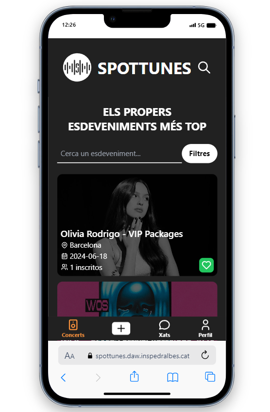

# Manual de Usuario

## Introducción

Bienvenido al manual de usuario de nuestra aplicación de red social para conciertos. Aquí aprenderás a utilizar todas las funciones de nuestra aplicación para que puedas disfrutar al máximo de tu experiencia.

## Instalación y Registro

### Requisitos del Sistema

- iOS 12.0 o superior
- Android 8.0 o superior

### Descarga e Instalación

1. Abre la tienda de aplicaciones en tu dispositivo (App Store para iOS, Google Play para Android).
2. Busca "Nombre de tu aplicación".
3. Haz clic en "Descargar" o "Instalar".
4. Una vez instalada, abre la aplicación desde tu pantalla de inicio.

### Proceso de Registro

1. Abre la aplicación.
2. Haz clic en "Registrarse".
3. Introduce tu correo electrónico, crea una contraseña y llena los campos requeridos.
4. Verifica tu correo electrónico siguiendo el enlace que te hemos enviado.
5. Completa tu perfil añadiendo una foto y una breve descripción sobre ti.

## Navegación por la Interfaz

### Pantalla de Inicio

La pantalla de inicio te muestra una lista de conciertos populares y eventos recomendados. Desde aquí, puedes explorar nuevos eventos y conectarte con otros usuarios.

### Menús y Navegación

Utiliza el menú inferior para navegar por las diferentes secciones de la aplicación, como el perfil, mensajes, y búsqueda de eventos.

## Funciones Principales

### Perfil del Usuario

#### Creación y Edición de Perfil

1. Abre tu perfil desde el menú inferior.
2. Haz clic en "Editar Perfil".
3. Añade o cambia tu foto, descripción y preferencias musicales.

#### Configuración de Preferencias

Ajusta tus preferencias de privacidad, notificaciones y otras configuraciones personales desde la sección de ajustes.

### Buscar y Conectar con Usuarios

#### Buscar Usuarios

Utiliza la barra de búsqueda para encontrar otros usuarios con intereses similares.

#### Enviar y Recibir Solicitudes de Amistad

Envía solicitudes de amistad y acepta o rechaza solicitudes recibidas desde la sección de notificaciones.

### Eventos y Conciertos

#### Buscar Eventos

Busca conciertos y eventos musicales según tus intereses.

#### Unirse a Eventos

Únete a un evento, confirma tu asistencia y ve quién más va a asistir.

## Solución de Problemas Comunes

### Preguntas Frecuentes

#### ¿Cómo recupero mi contraseña?

1. En la pantalla de inicio de sesión, haz clic en "¿Olvidaste tu contraseña?".
2. Introduce tu correo electrónico y sigue las instrucciones enviadas a tu correo.

#### ¿Por qué no puedo ver ciertos eventos?

Asegúrate de que tu configuración de filtros en la búsqueda de eventos esté correctamente configurada y que no hayas excluido ciertos tipos de eventos sin querer.

### Errores Comunes

#### Error de Conexión

Verifica tu conexión a internet y asegúrate de que estás utilizando la última versión de la aplicación.

