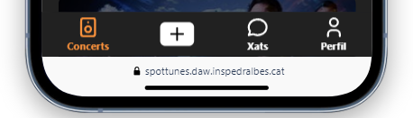

# Manual de Usuario

## Introducción

Bienvenido al manual de usuario de nuestra aplicación de red social para conciertos. Aquí aprenderás a utilizar todas las funciones de nuestra aplicación para que puedas disfrutar al máximo de tu experiencia.

## Instalación y Registro

### URL de Spottunes

- [Spottunes](https://spottunes.daw.inspedralbes.cat)

### Proceso de Registro

1. Entra en [Spottunes](https://spottunes.daw.inspedralbes.cat).
2. Haz clic en "Iniciar Sessión".
3. Si ya te hicistes una cuenta introduce tu contraseña y tu correo, independientemente de con que hicistes el Registro. 
4. Sino tienes cuenta haz clic en Registra't e introduce tus datos, tambien tienes la opción de poder hacerlo con  o :

## Navegación por la Interfaz

### Pantalla de Inicio

La pantalla de inicio  te muestra una lista de conciertos populares y eventos recomendados. Desde aquí, puedes explorar nuevos eventos y conectarte con otros usuarios.

### Menús y Navegación

Utiliza el menú inferior para navegar por las diferentes secciones de la aplicación, como el perfil, xats, y búsqueda de eventos.

## Funciones Principales 

### Perfil del Usuario 

#### Creación y Edición de Perfil

1. Abre tu perfil desde el menú inferior. 
2. Haz clic en "Editar el perfil".
3. Añade o cambia tu foto, nombre de usuario, nombre y apellidos...

### Buscar y Conectar con Usuarios

#### Buscar Usuarios

1. Utiliza la lupa de búsqueda situada en la parte superior derecha de la pantalla de inicio  para encontrar otros usuarios con intereses similares o cualquier usuario registrado en Spottunes. 
2. Desde aquí, puedes ver:
   - Los eventos a los que han dado like.
   - Sus posts.
   - Toda la información de su perfil, como el avatar, número de seguidores y seguidos.

#### Seguir a Usuarios

1. Para seguir a usuarios, usa la lupa de búsqueda en la parte superior derecha de la pantalla de inicio .
2. Cuando realices la búsqueda, aparecerá el perfil del usuario junto a un botón de "Seguir".

3. Si deseas ver el perfil antes de seguir a alguien, haz clic en el perfil del usuario.
4. En la parte superior derecha del perfil, también encontrarás el botón de "Seguir".

### Eventos y Conciertos

#### Buscar Eventos

1. Busca conciertos y eventos musicales según tus intereses utilizando la barra de búsqueda en la pantalla de inicio .

#### Filtrar Eventos

1. En el apartado de buscar eventos, puedes utilizar filtros por geolocalización.
2. Marca una zona en el mapa y siempre te aparecerán los eventos dentro del radio que especifiques.
3. Por ejemplo, si estableces un radio de 50 km, el sistema tomará el centro donde has clicado y te mostrará todos los eventos alrededor hasta 50 km.

#### Unirse/Seguir a Eventos

1. Únete o sigue a un evento.
2. Confirma tu asistencia y ve quién más va a asistir.
3. Conoce a gente a través de la lista de personas que están siguiendo el evento al que vas a asistir.

## Chats

El chat en nuestra aplicación se encuentra en el apartado **Xat**. Aquí, puedes comunicarte fácilmente con otros usuarios y organizar tus planes para asistir a conciertos. A continuación, se detallan las características principales del chat:

1. **Buscador de Usuarios**:
   - En la parte superior del apartado **Xat**, encontrarás un buscador de usuarios. Puedes utilizar este buscador para encontrar a cualquier usuario registrado en Spottunes.
   - Simplemente introduce el nombre del usuario en la barra de búsqueda y selecciona el perfil adecuado de los resultados que aparecen.

2. **Iniciar un Chat**:
   - Una vez que hayas encontrado al usuario con el que deseas comunicarte, haz clic en su nombre o foto de perfil para iniciar un chat.
   - Esto abrirá una ventana de chat donde podrás enviar mensajes instantáneos.

3. **Funciones del Chat**:
   - **Enviar Mensajes**: Escribe tu mensaje en el cuadro de texto y presiona "Enter" o haz clic en el icono de enviar para enviar tu mensaje.

4. **Historial del Chat**:
   - Todos los mensajes enviados y recibidos se almacenan en el historial del chat. Puedes revisar tus conversaciones anteriores en cualquier momento navegando hacia arriba en la ventana del chat.

5. **Notificaciones de Mensajes**:
   - Recibirás notificaciones en tiempo real cuando recibas un nuevo mensaje.

## Posts
### Crear un Post

Para compartir tus experiencias y opiniones sobre conciertos, puedes crear posts. Aquí te mostramos cómo hacerlo:

1. Ve a la sección de + desde el menú inferior.
2. Escribe experiencias o próximos eventos a los que asistirás.
3. Si deseas adjuntar una imagen, haz clic en el icono de la galeria y selecciona una imagen de tu dispositivo.
4. Haz clic en "Post" para publicar tu post con la comunidad en tu perfil.

### Interactuar con Posts

Puedes interactuar con los posts de otros usuarios de las siguientes maneras:

- **Dar Like**: Haz clic en el icono de corazón para dar like a un post.
- **Comentar**: Haz clic en el icono de comentario para añadir una respuesta o comentario al post.

### Ver Posts de Usuarios

En la sección de posts dentro de cada usuario, puedes ver las publicaciones que ha hecho el usuario. Esta es una excelente manera de mantenerte al tanto de lo que otros amantes de la música están diciendo y haciendo.

## Solución de Problemas Comunes

### Preguntas Frecuentes

#### ¿Por qué no puedo ver ciertos eventos?

Asegúrate de que tu configuración de filtros en la búsqueda de eventos esté correctamente configurada y que no hayas excluido ciertos tipos de eventos sin querer.