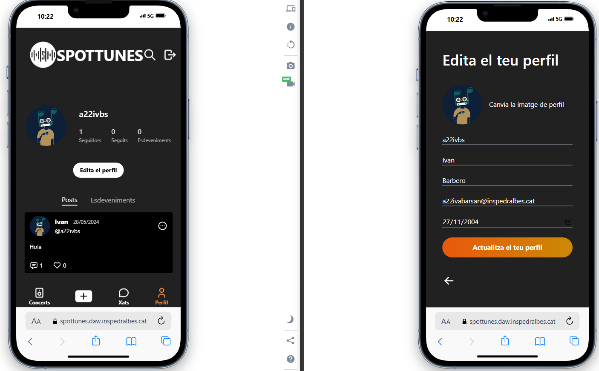
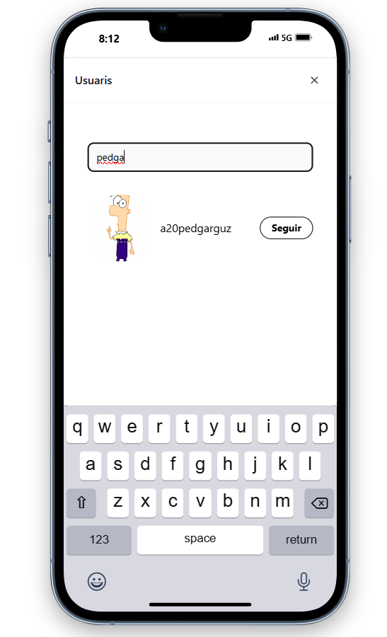

# Manual de Usuari

## Introducció

Benvingut al manual d'usuari de la nostra aplicació de xarxa social per a concerts. Aquí aprendràs a utilitzar totes les funcions de la nostra aplicació perquè puguis gaudir al màxim de la teva experiència.

## Registre d'Usuari

### URL de Spottunes

- [Spottunes](https://spottunes.daw.inspedralbes.cat)

### Procés de Registre

1. Entra a [Spottunes](https://spottunes.daw.inspedralbes.cat).
2. Fes clic a "Iniciar Sessió".
3. Si ja tens un compte, introdueix la teva contrasenya i el teu correu, independentment de com hagis fet el Registre.
4. Si no tens compte, fes clic a "Registra't" i introdueix les teves dades, també tens l'opció de poder fer-ho amb  o :

## Navegació per la Interfície

### Funcionalitats per a Usuaris No Registrats
Si no estàs registrat, l'única funcionalitat disponible en tota l'aplicació és la cerca d'esdeveniments. No podràs accedir a altres seccions com la creació de posts, el xat amb altres usuaris o l'edició del teu perfil.
Utilitza el menú inferior per navegar per les diferents seccions de l'aplicació, com el perfil, xats, i cerca d'esdeveniments.

### Menús i Navegació

### Posts

La icona  en el menú inferior et permet crear un nou post. Des d'aquí, pots compartir els teus pensaments, fotos, i experiències sobre concerts i esdeveniments musicals amb altres usuaris.

### Xat

A la icona , pots cercar un usuari específic per iniciar un xat amb el botó situat a la part superior dreta . Utilitza el cercador d'usuaris per trobar la persona registrada a Spottunes amb la qual desitges comunicar-te i comença la conversa.

### Perfil

A la icona , pots veure i editar el teu perfil. Aquí pots actualitzar la teva informació personal, canviar la teva foto de perfil i gestionar les teves preferències.

### Pantalla de Inici

La pantalla de inici  et mostra una llista de concerts populars i esdeveniments recomanats. Des d'aquí, pots explorar nous esdeveniments i connectar amb altres usuaris.

## Funcions Principals 

### Perfil de l'Usuari 

#### Creació i Edició de Perfil

1. Obre el teu perfil des del menú inferior. 
2. Fes clic a "Editar el perfil".
3. Afegeix o canvia la teva foto, nom d'usuari, nom i cognoms...

## Cercar i Connectar amb Usuaris

#### Cercar Usuaris

1. Utilitza la lupa  de cerca situada a la part superior dreta de la pantalla de inici  per trobar altres usuaris amb interessos similars o qualsevol usuari registrat a Spottunes. 
2. Des d'aquí, pots veure:
   - Els esdeveniments als quals han donat like.
   - Els seus posts.
   - Tota la informació del seu perfil, com l'avatar, número de seguidors i seguits.

Aquí un exemple:

#### Seguir Usuaris

1. Per seguir usuaris, utilitza la lupa  de cerca a la part superior dreta de la pantalla de inici .
2. Quan facis la cerca, apareixerà el perfil de l'usuari junt amb un botó de "Seguir".

3. Si desitges veure el perfil abans de seguir algú, fes clic al perfil de l'usuari.
4. Dins del perfil a la part superior dreta, també trobaràs el botó de "Seguir".

## Esdeveniments i Concerts

#### Cercar Esdeveniments

1. Cerca concerts i esdeveniments musicals segons els teus interessos utilitzant la barra de cerca a la pantalla de inici .

#### Filtrar Esdeveniments

##### Per Mapa:
1. A la barra de cerca d'esdeveniments, pots utilitzar el botó  per poder filtrar per geolocalització.
2. A l'apartat  marca una zona al mapa i sempre t'apareixeran els esdeveniments dins del radi que especifiquis.
3. Per exemple, si estableixes un radi/distància d'11 km, el sistema prendrà el centre on has clicat i et mostrarà tots els esdeveniments al voltant fins a 11 km.
3. Quan acabis de personalitzar els filtres, fes clic al botó 

##### Per Filtres:

1. Pots filtrar per determinats filtres també a l'apartat 
2. Selecciona un país, una ciutat i un establiment/espai
3. Quan acabis de personalitzar els filtres, fes clic al botó 

#### Unir-se/Seguir/Like a Esdeveniments

1. Uneix-te o segueix un esdeveniment, hi ha diversos botons, a la vista de inici , és aquest botó: .
2. I també a la vista d'un esdeveniment, quan entres el botó  a l'esdeveniment situat a la part superior dreta.
3. Seguir un esdeveniment confirma la teva assistència i et permet veure qui més hi assistirà.
4. Coneix gent a través de la llista de persones que estan seguint l'esdeveniment al qual assistiràs.

## Xats

El xat en la nostra aplicació es troba a l'apartat **Xat**. Aquí, pots comunicar-te fàcilment amb altres usuaris i organitzar els teus plans per assistir a concerts. A continuació, es detallen les característiques principals del xat:

1. **Cercador d'Usuaris** :
   - A la part superior de l'apartat **Xat**, trobaràs un cercador d'usuaris . Pots utilitzar aquest cercador per trobar qualsevol usuari registrat a Spottunes.
   - Simplement introdueix el nom de l'usuari a la barra de cerca i selecciona el perfil adequat dels resultats que apareixen.

2. **Iniciar un Xat**:
   - Un cop hagis trobat l'usuari amb qui desitges comunicar-te, fes clic al seu nom o foto de perfil per iniciar un xat.
   - Això obrirà una finestra de xat on podràs enviar missatges instantanis.

3. **Funcions del Xat**:
   - **Enviar Missatges**: Escriu el teu missatge al quadre de text i prem "Enter" o fes clic a la icona  per enviar el teu missatge.

4. **Historial del Xat**:
   - Tots els missatges enviats i rebuts es guarden a l'historial del xat. Pots revisar les teves converses anteriors en qualsevol moment navegant cap amunt a la finestra del xat.

5. **Notificacions de Missatges**:
   - Rebràs notificacions en temps real quan rebis un nou missatge.

## Posts
### Crear un Post 

Per compartir les teves experiències i opinions sobre concerts, pots crear posts. Aquí et mostrem com fer-ho:

1. Ves a l'apartat  des del menú inferior.
2. Escriu experiències o pròxims esdeveniments als quals assistiràs.
3. Si desitges adjuntar una imatge, fes clic a la icona de  i selecciona una imatge del teu dispositiu.
4. Fes clic a  per publicar el teu post amb la comunitat en el teu perfil.

### Interactuar amb Posts

Pots interactuar amb els posts d'altres usuaris de les següents maneres:

- **Donar Like**: Fes clic a la icona  per donar like a un post.
- **Comentar**: Fes clic a la icona  per afegir una resposta o comentari al post.
- **Esborrar el teu post**: Fes clic a la icona  i seguidament . Si no és el teu post no podràs eliminar-lo.

### Veure Posts d'Usuaris

A la secció de posts dins de cada usuari, pots veure les publicacions que ha fet l'usuari. Aquesta és una excel·lent manera de mantenir-te al corrent del que altres amants de la música estan dient i fent.

## Solució de Problemes Comuns

### Preguntes Freqüents

#### Per què no puc veure certs esdeveniments?

Assegura't que la teva configuració de filtres en la cerca d'esdeveniments estigui correctament configurada i que no hagis exclòs certs tipus d'esdeveniments sense voler.
