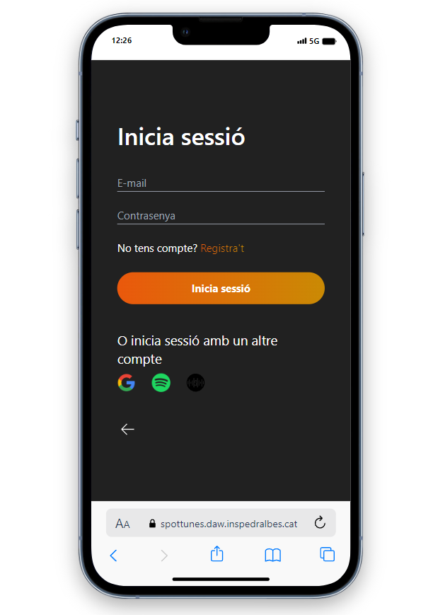

# Manual de Usuario

## Introducción

Bienvenido al manual de usuario de nuestra aplicación de red social para conciertos. Aquí aprenderás a utilizar todas las funciones de nuestra aplicación para que puedas disfrutar al máximo de tu experiencia.

## Instalación y Registro

### URL de Spottunes

- [Spottunes](https://spottunes.daw.inspedralbes.cat)

### Proceso de Registro

1. Entra en [Spottunes](https://spottunes.daw.inspedralbes.cat).
2. Haz clic en "Iniciar Sessión".
3. Si ya te hicistes una cuenta introduce tu contraseña y tu correo, independientemente de con que hicistes el Registro. 
4. Sino tienes cuenta haz clic en Registra't e introduce tus datos, tambien tienes la opción de poder hacerlo con  o :

## Navegación por la Interfaz

### Pantalla de Inicio

La pantalla de inicio  te muestra una lista de conciertos populares y eventos recomendados. Desde aquí, puedes explorar nuevos eventos y conectarte con otros usuarios.

### Menús y Navegación

Utiliza el menú inferior para navegar por las diferentes secciones de la aplicación, como el perfil, xats, y búsqueda de eventos.

## Funciones Principales 

### Perfil del Usuario 

#### Creación y Edición de Perfil

1. Abre tu perfil desde el menú inferior. 
2. Haz clic en "Editar el perfil".
3. Añade o cambia tu foto, nombre de usuario, nombre y apellidos...

### Buscar y Conectar con Usuarios

#### Buscar Usuarios

Utiliza la lupa de búsqueda situada en la parte superior derecha que hay en inicio  para encontrar otros usuarios con intereses similares o cualquier usuario que quieras buscar registrado en Spottunes. Donde puedes ver los eventos que ha dado like, posts, y toda la información de perfil como avatar, numero de seguidores y seguidos...

#########FOTO INICIO PARA QUE SE VEA LA LUPA

#### Seguir a usuarios

Para seguir a usuarios puedes usar la lupa de busqueda en la parte superior derecha que hay en inicio . Y cuando realices la busqueda aparecerá el perfil y al lado un boton de seguir. 

#########FOTO DEL BUSCADOR DE USUARIOS

Si quieres ver el perfil antes de seguir clica en el perfil y en la parte superior derecha esta también el botón de seguir

#########Foto de dentro de un perfil

### Eventos y Conciertos

#### Buscar Eventos

Busca conciertos y eventos musicales según tus intereses, puedes buscarlo en inicio , en la barra de buscador.

#### Filtrar Eventos

En el apartado de buscar eventos cabe decir que tenemos filtros por geolocalización. Puedes marcar una zona en el mapa y siempre te aparecerán los eventos en el radio que pongas. Por ejemplo, si pones un radio de 50 km, el sistema tomará el centro donde has clicado y te mostrará todos los eventos alrededor hasta 50 km, que es lo que has limitado.

#### Unirse/Seguir a Eventos

Únete a un evento, confirma tu asistencia y ve quién más va a asistir.

## Solución de Problemas Comunes

### Preguntas Frecuentes

#### ¿Por qué no puedo ver ciertos eventos?

Asegúrate de que tu configuración de filtros en la búsqueda de eventos esté correctamente configurada y que no hayas excluido ciertos tipos de eventos sin querer.

### Errores Comunes

#### Error de Conexión

Verifica tu conexión a internet y asegúrate de que estás utilizando la última versión de la aplicación.

